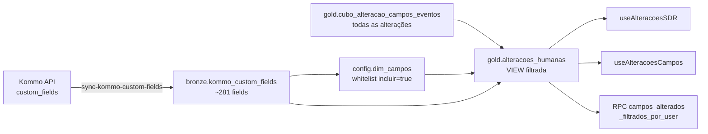

# Regras de Negócio — BI Urânia

Este arquivo consolida conceitos de domínio, fórmulas, definições e exclusões que valem para múltiplos dashboards. Cada regra aponta para onde está implementada no código.

## Pipelines (funis) do Kommo

A Urânia mantém vários funis no Kommo. O BI se importa com alguns grupos específicos:

### Funis de pré-venda
- **`Recepção Leads Insta`** — entrada de leads vindos do Instagram (triado por SDR)
- **`Vendas WhatsApp`** — recebe leads que entram em contato com nossos telefones de contato via WhatsApp; na primeira metade do funil quem atua são os SDR enquanto no fim são os Consultores Inbound
- **`Outbound`** — leads prospectados ativamente e trabalhados pelos Consultores Outbound
- **`Resgate/Nutrição Whats`** — leads que já foram trabalhados no funil de Vendas WhatsApp, mas não tiveram uma negativa direta então são trabalhados e reativados com cadência maior

### Funis de pós-venda (leads já fechados)
- **`Onboarding Escolas`**
- **`Onboarding SME`**
- **`Financeiro`**
- **`Clientes - CS`**
- **`Shopping Fechados`** (constante `FUNIS_FECHADOS` em [`desempenho-vendedor/hooks/useDesempenhoVendedor.ts:6`](../src/areas/comercial/desempenho-vendedor/hooks/useDesempenhoVendedor.ts#L6) e [`campanhas/types.ts`](../src/areas/comercial/campanhas/types.ts))

### Campo derivado `status_lead` em `gold.cubo_leads_consolidado`

Este **não é um campo nativo do Kommo** — é derivado pela função `gold.refresh_leads_consolidado()` a partir do estado atual do lead (`bronze.kommo_leads_raw`). Quatro valores possíveis, avaliados nesta ordem de precedência (primeiro que bater ganha):

| Ordem | Valor | Condição |
|---|---|---|
| 1º | `'Cancelado'` | `custom_fields.'Cancelado (Onboarding)' = 'Sim'` |
| 2º | `'Venda Fechada'` | `pipeline_name IN ('Onboarding Escolas', 'Onboarding SME', 'Financeiro', 'Clientes - CS', 'Shopping Fechados')` **E** `custom_fields.'Data de Fechamento' IS NOT NULL` |
| 3º | `'Venda Perdida'` | `status_name ILIKE '%perdida%' OR status_name ILIKE '%lost%'` |
| 4º | `'Em andamento'` | Fallback — nenhuma das anteriores |

SQL real da `refresh_leads_consolidado`:

```sql
CASE
  WHEN l.custom_fields->>'Cancelado (Onboarding)' = 'Sim'
    THEN 'Cancelado'
  WHEN l.pipeline_name IN ('Onboarding Escolas','Onboarding SME','Financeiro','Clientes - CS','Shopping Fechados')
    AND l.custom_fields->>'Data de Fechamento' IS NOT NULL
    THEN 'Venda Fechada'
  WHEN l.status_name ILIKE '%perdida%' OR l.status_name ILIKE '%lost%'
    THEN 'Venda Perdida'
  ELSE 'Em andamento'
END AS status_lead
```

**Observações importantes:**

- **Leads cancelados são excluídos de fechamentos e diárias.** Mesmo que a venda tenha sido efetivada antes do cancelamento, um lead com `custom_fields.'Cancelado (Onboarding)' = 'Sim'` é classificado como `'Cancelado'` e não conta como `'Venda Fechada'`. Os blocos "Fechamentos" e "Diárias" do Desempenho Vendedor mostram um aviso visível sobre essa exclusão.
- **Um lead cancelado que tem `Data de Fechamento` preenchida ainda é `'Cancelado'`**, nunca `'Venda Fechada'` — a cláusula 1 tem precedência.
- **`Data de Fechamento`** é um custom field editado manualmente pelo time (não é `closed_at` nativo do Kommo). Ver [Sobre `data_de_fechamento`](#sobre-data_de_fechamento).
- **`status_name`** é o estágio atual (ex.: `'Negociação'`, `'Lost'`, `'Venda perdida'`) — o `ILIKE '%perdida%'` é proposital para pegar variações de nomenclatura.
- **"Venda Fechada" exige ambas as condições**: estar em pipeline de pós-venda **E** ter Data de Fechamento. Se só está no funil mas sem a data, fica `'Em andamento'`; se só tem a data mas está em outro funil, também.

### Sobre `vendedor` (`cubo_leads_consolidado.vendedor`)

O campo **não** é `l.custom_fields->>'Vendedor/Consultor'` direto. A função `gold.refresh_leads_consolidado` aplica uma **regra de precedência tripla** (v4) para decidir o vendedor efetivo de cada lead:

| Ordem | Fonte | Quando |
|---|---|---|
| 1º | `config.lead_vendedor_override.vendedor` | Override manual cadastrado — sempre ganha |
| 2º | `moved_by` do último `Closed - won` em **funil de vendas** (não pós-venda) | `moved_by` existe **E** (algum usuário do grupo `'Sucesso do cliente'` alterou o custom field pós-saída do onboarding **OU** o valor atual do custom field pertence a alguém do grupo `'Sucesso do cliente'`) |
| 3º | `custom_fields->>'Vendedor/Consultor'` | Padrão — valor atual no Kommo |

**Motivação:** o campo `Vendedor/Consultor` é editável por qualquer usuário do Kommo. Até abril/2026, quando o lead entrava em `Clientes - CS` uma automação atribuía a conta de CS ao campo — e o time de CS continuava alterando manualmente quando tomava o atendimento. Ambos os fluxos foram descontinuados, mas os dados históricos refletem o problema. A regra v4 detecta esse padrão e devolve o vendedor real (quem efetivamente bateu Closed-won em funil de vendas).

**"Saída do onboarding"** é a primeira movimentação com `pipeline_from ∈ ('Onboarding Escolas','Onboarding SME','Financeiro')` para um funil **fora** do conjunto pós-venda — tipicamente `pipeline_to = 'Clientes - CS'`.

**Casos de borda históricos** (leads pré-2026-01 sem histórico de events; plantão onde o `moved_by` de Closed-won não é o vendedor real; correções manuais erradas no CRM): registra-se em `config.lead_vendedor_override` com `lead_id`, `vendedor`, `motivo`. Precedência máxima. Daqui em diante, com automação e alterações manuais desligadas, essa tabela deve crescer pouco.

**Exemplos de overrides ativos:**
- `19377171` — APMF Escola São Sebastião → Catarine Manara (histórico pré-2026-01)
- `24595621` — Colégio CEOC → Rafael Araújo (plantão: Juliana bateu Closed-won, Rafael era o real)

### Sobre `data_de_fechamento`

Em `gold.cubo_leads_consolidado`, é parseado de `custom_fields.'Data de Fechamento'` como Unix epoch:

```sql
CASE WHEN (l.custom_fields->>'Data de Fechamento') ~ '^\d{9,10}$'
  THEN to_timestamp((l.custom_fields->>'Data de Fechamento')::bigint)::date
  ELSE NULL END
```

Mesmo padrão vale para `data_e_hora_do_agendamento` e `data_cancelamento`.

### Fim de funil de Vendas WhatsApp
Estágios de "fim de funil" (onde o vendedor está em negociação avançada), usados no bloco Consistência CRM:
- `'Venda provável'`
- `'Geladeira'`
- `'Negociação'`
- `'Falar com Direção/Decisor'`

Definidos em `FIM_FUNIL_ESTAGIOS` em [`monitoramento/types.ts`](../src/areas/comercial/monitoramento/types.ts).

## Grupos de usuários

Em `bronze.kommo_users.group_name` (populado via `/api/v4/account?with=users_groups` no sync diário):
- `Consultores Inbound` (group_id 622096) — vendedores inbound
- `Consultores Outbound` (group_id 690324)
- `SDR` (group_id 645176)
- `Onboarding / Financeiro` (group_id 645284)
- `Sucesso do cliente` (group_id 645288) — CS
- `Planetários`, `Administrativo`, `Tecnologia e Processos`, `Marketing`, etc.

### Quem conta como "vendedor" nos dashboards?

Como `vendedor` é um **custom field editável** (não o grupo do Kommo), usamos **todos os usuários ativos** (`bronze.kommo_users.is_active = true`) como whitelist. Leads atribuídos a pessoas fora dos grupos de consultores (ex: Karen em "Sucesso do cliente" atuando num plantão) contam desde que a pessoa ainda esteja ativa. Vendedores desligados são excluídos.

Ver `useVendedoresAtivos` em [`desempenho-vendedor/hooks/useDesempenhoVendedor.ts`](../src/areas/comercial/desempenho-vendedor/hooks/useDesempenhoVendedor.ts).

### SDR
`SDR` continua filtrando explicitamente por grupo:
```ts
.eq('is_active', true).eq('group_name', 'SDR')
```

## Janela de horário comercial

Todas as métricas de produtividade (tempo de resposta, mensagens diárias, campos alterados) consideram apenas **segunda a sexta, 7h às 19h, fuso `America/Sao_Paulo`**.

### `dentro_janela` (coluna booleana em `gold.cubo_*`)

Computado na refresh:
```sql
EXTRACT(ISODOW FROM created_at AT TIME ZONE 'America/Sao_Paulo') <= 5
AND EXTRACT(HOUR FROM created_at AT TIME ZONE 'America/Sao_Paulo') BETWEEN 7 AND 18
```

Observe o `BETWEEN 7 AND 18` — inclui a hora 18 (i.e., eventos das 18:00 até 18:59), o que efetivamente cobre até as 19h.

### Função `public.business_minutes(from, to) → integer`

Usada para calcular `response_minutes` em `gold.tempo_resposta_mensagens`. Conta minutos em janela comercial (seg-sex, 7h-19h BRT). Mensagem recebida sexta 18:50 e respondida segunda 08:00 = **70 minutos úteis** (10 min de sexta + 60 min de segunda).

Ver implementação em `public.business_minutes` — detalhes em [`data-model.md`](data-model.md#publicbusiness_minutesfrom_ts-to_ts--integer).

## Faixas de tempo de resposta

Constante `FAIXAS_TEMPO` em [`desempenho-sdr/types.ts`](../src/areas/comercial/desempenho-sdr/types.ts) e [`desempenho-vendedor/types.ts`](../src/areas/comercial/desempenho-vendedor/types.ts):

```ts
['< 5 min', '< 10 min', '< 15 min', '< 30 min', '> 30 min']
```

Atribuídas em `gold.tempo_resposta_mensagens.faixa` com base em `response_minutes`:

| faixa | response_minutes |
|---|---|
| `'< 5 min'` | 0 ≤ m < 5 |
| `'< 10 min'` | 5 ≤ m < 10 |
| `'< 15 min'` | 10 ≤ m < 15 |
| `'< 30 min'` | 15 ≤ m < 30 |
| `'> 30 min'` | m ≥ 30 |

## Nota de tempo de resposta (`calcNotaTempo`)

Transforma a distribuição de faixas de um vendedor/SDR em uma nota 0–1, onde 1 = excelente (todas < 5 min) e 0 = péssimo (todas > 30 min).

Implementação em [`desempenho-sdr/types.ts:67-76`](../src/areas/comercial/desempenho-sdr/types.ts) e [`desempenho-vendedor/types.ts:79-89`](../src/areas/comercial/desempenho-vendedor/types.ts):

```ts
const PESOS_FAIXA: Record<string, number> = {
  '< 5 min':  1.0,
  '< 10 min': 0.25,
  '< 15 min': -0.5,
  '< 30 min': -1.25,
  '> 30 min': -2.0,
};

function calcNotaTempo(faixaCounts: Record<string, number>): number {
  const total = Object.values(faixaCounts).reduce((s, v) => s + v, 0);
  if (total === 0) return 0;
  let score = 0;
  for (const f of FAIXAS_TEMPO) {
    const pct = (faixaCounts[f] || 0) / total;
    score += pct * PESOS_FAIXA[f];
  }
  // score ∈ [-2, 1] → normaliza para [0, 1] com curva quadrática
  const normalized = (score + 2) / 3;
  return Math.max(0, Math.min(1, normalized ** 2));
}
```

**Uso:** nota individual do SDR em `Bloco1Geral` + nota individual/geral do vendedor em `BlocoTempoResposta`.

## MPA — Meta de Performance do Atendimento (SDR)

Nota composta (0-100+%) que combina quatro métricas de um SDR contra sua meta nível:

Implementação em [`desempenho-sdr/types.ts:100-116`](../src/areas/comercial/desempenho-sdr/types.ts):

```ts
function calcMPA(
  exec_tempo: number,   meta_tempo: number,    // nota tempo vs. meta (0-1)
  exec_msg: number,     meta_msg: number,      // msg/dia vs. meta
  exec_campos: number,  meta_campos: number,   // campos/dia vs. meta
  exec_conv: number,    meta_conv: number      // % conversão vs. meta
): number {
  const ratio_tempo  = exec_tempo / meta_tempo;
  const ratio_msg    = exec_msg / meta_msg;
  const ratio_campos = exec_campos / meta_campos;
  const ratio_conv   = exec_conv / meta_conv;
  return (
    0.35 * ratio_tempo +
    0.20 * ratio_msg +
    0.20 * ratio_campos +
    0.25 * ratio_conv
  ) * 100;
}
```

**Pesos fixos:**
- Tempo de resposta: **35%** (maior peso)
- Mensagens diárias: **20%**
- Campos alterados: **20%**
- Conversão: **25%**

**Metas** vêm de `config.metas_sdr`, por `nivel` do SDR (`dim_sdrs.nivel`).

## Multiplicador de comissão (SDR)

Implementação em [`desempenho-sdr/types.ts:91-97`](../src/areas/comercial/desempenho-sdr/types.ts):

```ts
function calcMultiplicador(mpa: number, multiplicadores: MultiplicadorComissao[]): number {
  if (mpa > 100) return mpa / 100;  // bypass da tabela quando supera meta
  const hit = multiplicadores.find((m) => mpa >= m.mpa_min && mpa <= m.mpa_max);
  return hit?.multiplicador ?? 0;
}
```

Tabela `config.multiplicadores_comissao` define, por faixa de MPA, o multiplicador aplicado à `comissao_variavel_base` do nível.

**Comissão final:**
```ts
comissao = meta_sdr.comissao_variavel_base * multiplicador
```

## Conversão do SDR (taxa de qualificação)

Implementação em `Bloco1Geral.tsx` e `Bloco5Qualificacao.tsx` ([src/areas/comercial/desempenho-sdr/components/](../src/areas/comercial/desempenho-sdr/components/)).

**Numerador (leads qualificados):** leads que, no período, tiveram um movimento em `gold.leads_movements` **movido pelo SDR em questão**, onde:
- `pipeline_from = 'Recepção Leads Insta' AND pipeline_to = 'Vendas WhatsApp'`, OU
- `status_to_id ∈ QUALIFICADO_SDR_STATUS_IDS` — helper `isQualificadoSDRById()` em [desempenho-sdr/types.ts](../src/areas/comercial/desempenho-sdr/types.ts)

**Por que `status_to_id` e não `status_to` (nome)?** Para ficar imune a rename de etapa no Kommo. O ID é estável; se a etapa "Qualificado SDR" for renomeada para "Lead Pré-Qualificado (SDR)" (ou qualquer outro nome), nada quebra. Se o time criar uma **nova etapa separada**, basta adicionar o novo ID ao `QUALIFICADO_SDR_STATUS_IDS`.

**IDs mapeados hoje:**
- `100952455` — "Qualificado SDR" no pipeline Vendas WhatsApp (único status de qualificação humana pelo SDR)

**Denominador (leads recebidos):** IDs únicos de leads que entraram em `Recepção Leads Insta` no período (qualquer movimento `pipeline_to = 'Recepção Leads Insta'` em `leads_movements`).

**Correção aplicada** (fix em Bloco5Qualificacao): o numerador só conta se o lead também está em `leadsRecebidos` do mesmo período — caso contrário, teríamos leads qualificados no período cujo recebimento foi em outro mês, inflando a taxa para >100%.

## Whitelist de campos humanos

Versão atual (substituiu a blacklist de 6 campos-bot). Toda alteração de custom field no Kommo vira evento em `gold.cubo_alteracao_campos_eventos`, mas só **~62 desses campos** são considerados ação humana para métricas de desempenho. O resto é bot, integração, tracking ou metadata automática.

### Arquitetura



### Como editar

Para marcar/desmarcar um campo:

```sql
-- Adicionar à whitelist
UPDATE config.dim_campos
SET incluir = true, nota = 'adicionado em dd/mm — razão'
WHERE campo_id = 1234567;

-- Remover
UPDATE config.dim_campos SET incluir = false WHERE campo_id = 1234567;

-- Listar whitelist atual ordenada por nome
SELECT dc.campo_id, kcf.name, dc.nota
FROM config.dim_campos dc
JOIN bronze.kommo_custom_fields kcf ON kcf.id = dc.campo_id
WHERE dc.incluir = true
ORDER BY kcf.name;
```

Mudanças têm efeito **imediato** — a view `gold.alteracoes_humanas` faz o `JOIN` em tempo real.

### Whitelist inicial (abril 2026)

62 campos marcados como `incluir = true` em `config.dim_campos`, selecionados a partir da lista de campos editáveis manualmente no CRM (confirmada pela Julia):

**Agendamento e venda:** Nome da escola, Produtos, Experiência, Conteúdo da apresentação, Observações, Data de Fechamento, Data e Hora do Agendamento, Data Ofertada, Nº de Diárias, Brinde, Faixa de alunos, Nº de alunos, Cidade - Estado, Horizonte de Agendamento, Astrônomo, Turnos do evento, Nível de Ensino, Professor/Matéria, CNPJ, Local coberto?, Cúpula

**Atribuição:** SDR, Vendedor/Consultor, Qualificado por

**Qualificação / ligações SDR:** Ligação 1 SDR, Ligação 2 SDR, Ligação efetuada, OBS ligação 1, Status ligação IA, Ult. interação, Mês pretendido para visita, Diagnóstico concluído, Astronomos sugeridos pela IA, Data sugerida p/ visita mês atual / seguinte / pretendido lead

**Negociação:** Proposta enviada, Aguardando decisor, Ajuste comercial, Motivo de Perda, Bot Ativo Negociação, Desativar Bot

**Reunião / apresentação:** Quantidade de reuniões feitas, Reunião feita, Dia da Reunião, Horário da Reunião, Resposável que Participará, E-mail Responsável, Score reunião

**Ofertas:** Ofereceu Astronerd?, Ofereceu Clube de assinatura?, Ofereceu Observação Noturna?

**Links / mídia:** PDF proposta Comercial personalizada Link, Site do lead, Mídia Consultor/vendedor (com site) Link, Mídia SDR link, Mídia Onboarding Consultor link

**Outros:** Anúncio, Whats de contato, Tipo de cliente, Data Reativação, Check Material

**Excluídos (exemplos):** Etapa do funil, Parar IA WhatsApp/Instagram, Origem da oportunidade, Canal de entrada, tracking 586018, Ult. lead, tags, campos de contato/company, UTM parameters e todos os ~190 campos que não envolvem ação direta de SDR/Vendedor.

### Consumo

Toda nova métrica relacionada a "alteração humana" deve consumir `gold.alteracoes_humanas`, nunca `gold.cubo_alteracao_campos_eventos` direto.

**Também aplicado em:** `gold.user_activities_humanas` view — fonte única do Monitoramento de Usuários. Filtra tanto campos bot quanto eventos de tarefa que não são criação/conclusão manual.

## Eventos de tarefa contados como ação humana

Do universo `task_*` de eventos no Kommo, o Monitoramento de Usuários só considera:

- `task_added` — tarefa criada manualmente
- `task_completed` — tarefa concluída manualmente

**Excluídos** (por serem edições de metadata ou ações não-produtivas):

- `task_text_changed` — edição do texto
- `task_deadline_changed` — mudança de prazo
- `task_type_changed` — mudança do tipo de tarefa
- `task_deleted` — exclusão
- `task_result_added` — adicionar resultado (frequentemente dobra contagem com `task_completed`)

Aplicado na view `gold.user_activities_humanas` (ver [data-model.md](data-model.md#goldu­ser_activities_humanas-view)).

**Filtro de usuário humano:** a tabela-base `gold.user_activities_daily` já faz `JOIN` com `bronze.kommo_users WHERE group_name IN ('SDR','Consultores Inbound') AND is_active = TRUE`, então eventos de automations com `created_by = 0` nunca entram.

## Deduplicação de passagens de lead

Um mesmo `id_lead` pode aparecer várias vezes em `gold.cubo_leads_consolidado` se fez múltiplas passagens (ex.: fechou, cancelou, voltou ao atendimento, fechou de novo). A chave `id_passagem = id_lead || '_' || pipeline_id || '_' || Data_de_Fechamento` distingue cada passagem.

**Para métricas de fechamento**, quase todos os hooks que puxam de `cubo_leads_consolidado` fazem dedup em JS mantendo apenas a **última** passagem (maior `data_de_fechamento`) por `id_lead`. Exemplo em [`campanhas/types.ts`](../src/areas/comercial/campanhas/types.ts) e [`desempenho-vendedor/components/BlocoCancelamentos.tsx`](../src/areas/comercial/desempenho-vendedor/components/BlocoCancelamentos.tsx).

## Exclusões recorrentes

### `tipo_lead = 'Shoppings'`
Leads do tipo "Shoppings" são excluídos de Faturamento e do bloco de Desempenho Vendedor — são negócios marginais que distorcem a métrica.

Aplicado em:
- [`useLeadsVendedor`](../src/areas/comercial/desempenho-vendedor/hooks/useDesempenhoVendedor.ts): `.neq('tipo_lead', 'Shoppings')`
- [`useLeadsFechados`](../src/areas/financeiro/hooks/useFaturamento.ts) (Faturamento): idem
- [`campanhas/types.ts`](../src/areas/comercial/campanhas/types.ts): filtro no aplicador

### Vendedores excluídos de Campanhas
Em [`campanhas/types.ts`](../src/areas/comercial/campanhas/types.ts), `filterCampanhaLeads` exclui:
- Vendedor nulo/vazio
- `'Daiana Léia'` e `'Daiana Leia'` (histórico, não participa de campanhas)

### Categorias excluídas em Monitoramento de Usuários
`'Tag'` e `'Vinculacao'` são excluídos das métricas de atividade em [`OverviewBlock.tsx`](../src/areas/comercial/monitoramento/components/OverviewBlock.tsx) e [`UserDetailBlock.tsx`](../src/areas/comercial/monitoramento/components/UserDetailBlock.tsx).

No Consistência CRM adicionalmente excluímos `'Outros'` e `'Campo alterado'` (este último substituído pela RPC filtrada) — ver [`ConsistenciaCRMBlock.tsx:20`](../src/areas/comercial/monitoramento/components/ConsistenciaCRMBlock.tsx).

## Definição de "Leads Abertos"

Snapshot atual:
```ts
.eq('status_lead', 'Em andamento')       // exclui Venda Fechada, Venda Perdida, Cancelado
.eq('funil_atual', 'Vendas WhatsApp')
.not('vendedor', 'is', null)
```

Usado em Monitoramento → Consistência CRM (coluna removida em versão atual, mas o conceito ficou para snapshot de tarefas).

## Definição de "Leads no Período" (atribuição temporal)

Introduzido na v4 do Consistência CRM. Conta leads únicos em que o vendedor foi responsável **em algum momento do período filtrado**, restritos a leads atualmente no pipeline `Vendas WhatsApp`.

**Dupla contagem intencional**: se um lead passou de V1 para V2 dentro do período, conta para ambos.

Reconstruído via RPC `gold.leads_atribuidos_por_user(p_from, p_to)` usando eventos `entity_responsible_changed` — ver [`data-model.md`](data-model.md#goldleads_atribuidos_por_userp_from-p_to--tableuser_id-leads).

**Limitação:** o filtro de pipeline usa o pipeline ATUAL (snapshot). Se um lead passou por Vendas WhatsApp e depois saiu para outro funil, não é capturado. Melhoria futura: juntar com `gold.leads_movements` para pipeline histórico.

## Classificação de Consistência CRM (faixas fixas)

Implementada em [`monitoramento/types.ts`](../src/areas/comercial/monitoramento/types.ts) (`classifyConsistencia`):

| Score (ações/lead no período) | Classificação |
|---|---|
| ≥ 3.0 | Boa |
| 1.5 – 3.0 | Moderada |
| 0.7 – 1.5 | Baixa |
| < 0.7 | Extremamente Baixa |

**Ações contadas:**
- Mensagens enviadas
- Movimentações
- Ligações
- Notas
- Tarefas (criadas/completadas)
- Campos alterados — **filtrados** (exclui os 6 campos bots)

**Ações ignoradas:** `'Tag'`, `'Vinculacao'`, `'Outros'` (categorias residuais).

## Ranking por Percentil

Mesma métrica `ações / leads no período`, mas classificada relativamente ao time, não a faixas fixas:

| Percentil (`ações/lead` do vendedor no time) | Faixa |
|---|---|
| ≥ P75 | Top 25% |
| P50 – P75 | Acima da Mediana |
| P25 – P50 | Abaixo da Mediana |
| < P25 | Bottom 25% |

Percentis calculados no frontend (função `percentile` em [`RankingPercentilBlock.tsx`](../src/areas/comercial/monitoramento/components/RankingPercentilBlock.tsx)) sobre **todo** o time de Consultores Inbound ativos — o filtro de usuário só afeta a exibição, não os cortes.

## Ticket Médio por Diária

Regra explicitada pelo time comercial: **cobramos por diária, não por lead**. Portanto:

```ts
ticket_medio = receita_total / total_diarias
```

Onde `total_diarias = sum(parseInt(numero_de_diarias))`.

Aplicado em:
- [`BlocoFaturamento.tsx`](../src/areas/comercial/desempenho-vendedor/components/BlocoFaturamento.tsx) (Desempenho Vendedor → Faturamento)
- [`leads-fechados/components/OverviewBlock.tsx`](../src/areas/comercial/leads-fechados/components/OverviewBlock.tsx) (Leads Fechados → Visão Geral)
- [`RankingTicketMedio.tsx`](../src/areas/comercial/campanhas/components/RankingTicketMedio.tsx) (Campanhas)

## Normalização de nomes de usuário

Nomes no Kommo às vezes aparecem como primeiro nome, outras como nome completo. Para consistência no agrupamento por vendedor/SDR, usamos um mapa manual.

Em [`desempenho-sdr/types.ts`](../src/areas/comercial/desempenho-sdr/types.ts) e [`desempenho-vendedor/types.ts`](../src/areas/comercial/desempenho-vendedor/types.ts):

```ts
export function normalizeUserName(name: string | null | undefined): string {
  if (!name) return 'Não atribuído';
  const trimmed = name.trim();
  // alias → nome padrão
  const ALIASES: Record<string, string> = {
    'Perla': 'Perla Nogueira',
    'Juliana': 'Juliana Rodrigues',
    // ... etc
  };
  return ALIASES[trimmed] ?? trimmed;
}
```

Sempre aplicar `normalizeUserName()` antes de `GROUP BY` em JS.

## Score de Qualidade (bucket)

Em `gold.leads_quality.score_qualidade`, o avaliador atribui uma das 4 faixas:

| Valor | Score numérico (no dashboard) | Significado |
|---|---|---|
| `'90–100 → Excelente'` | 95 | |
| `'75–89 → Bom'` | 82 | |
| `'60–74 → Regular'` | 67 | |
| `'<60 → Crítico'` | 40 | |

Mapeamento em `SCORE_MAP` em [`qualidade/types.ts`](../src/areas/comercial/qualidade/types.ts).

## Top Ofensores (Diagnóstico de Qualidade)

Nove critérios onde conta-se "quantos % estão respondendo negativamente". Ordenado DESC, top 3 viram KPI destacado em `DiagnosticBlock`.

Critérios negativos:
1. Abordagem Inicial = `'Ruim'`
2. Personalização = `'Não'`
3. Clareza = `'Não'`
4. Conectou Solução = `'Não'`
5. Explicou Benefícios = `'Não'`
6. Personalizou Argumentação = `'Não'`
7. Desconto Justificado = `'Não'` (excluindo `'Não se aplica'` do denominador)
8. Quebrou Preço = `'Sim'` (excluindo `'Não se aplica'`)
9. Próximo Passo = `'Não'`

Ver [`DiagnosticBlock.tsx`](../src/areas/comercial/qualidade/components/DiagnosticBlock.tsx).

## Astronerd (filtro de produto)

Em [`RankingAstronerd.tsx`](../src/areas/comercial/campanhas/components/RankingAstronerd.tsx), leads de Astronerd são identificados por:

```ts
const isAstronerd = (l: LeadCampanha) =>
  l.produtos?.toLowerCase().includes('astronerd') ||
  l.conteudo_apresentacao?.toLowerCase().includes('astronerd');
```

## Dense Rank (rankings de Campanhas)

Rankings de campanha (Ticket Médio, Leads, Diárias, Faturamento, Astronerd) usam **dense rank** em JavaScript — empates recebem o mesmo número, sem pular posições (1, 1, 2, 3 em vez de 1, 1, 3, 4).

Implementação típica:
```ts
let lastValue: number | null = null;
let rank = 0;
rows.forEach((r, i) => {
  if (r.value !== lastValue) {
    rank++;
    lastValue = r.value;
  }
  r.rank = rank;
});
```

## Prêmios em Campanhas

- **Ticket Médio**: R$ 500 para o 1º lugar (threshold mínimo: 10 leads). [`RankingTicketMedio.tsx`](../src/areas/comercial/campanhas/components/RankingTicketMedio.tsx)
- **Diárias**: R$ 300 rateado entre empates no 1º lugar. Ex.: 2 empates no topo → R$ 150 cada. [`RankingDiarias.tsx`](../src/areas/comercial/campanhas/components/RankingDiarias.tsx)

## Metas de Faturamento (tema espacial)

Em [`SpaceProgress.tsx`](../src/areas/financeiro/components/SpaceProgress.tsx), cada meta vira um "planeta" no trajeto Terra → Lua:
- 70% → vermelho (#ef4444)
- 80% → amarelo (#eab308)
- 90% → verde (#22c55e)
- 100% → verde escuro (#15803d)

Planetas atingidos aparecem sólidos; não-atingidos, opacos.
