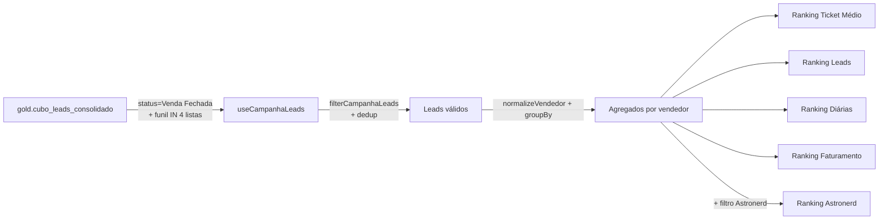

# Dashboard — Campanhas Semanais

Cinco rankings de performance para campanhas comerciais (semanal/mensal). Cada ranking é uma tabela ordenada por uma métrica específica, com prêmios em R$ quando aplicável.

## Rota

`/comercial/campanhas` — perfil `comercial`.

## Estrutura de arquivos

```
src/areas/comercial/campanhas/
├── pages/Dashboard.tsx
├── hooks/useCampanhas.ts
├── types.ts
└── components/
    ├── RankingTicketMedio.tsx
    ├── RankingLeadsFechados.tsx
    ├── RankingDiarias.tsx
    ├── RankingFaturamento.tsx
    └── RankingAstronerd.tsx
```

## Fonte de dados

`gold.cubo_leads_consolidado` — filtrada pelo hook `useCampanhaLeads` e depois pelo aplicador `filterCampanhaLeads` em [`types.ts`](../../src/areas/comercial/campanhas/types.ts).

### Hook `useCampanhaLeads()` — [`hooks/useCampanhas.ts`](../../src/areas/comercial/campanhas/hooks/useCampanhas.ts)

```ts
await supabase
  .schema('gold')
  .from('cubo_leads_consolidado')
  .select('id_lead, nome_lead, valor_total, vendedor, data_de_fechamento, ' +
          'data_e_hora_do_agendamento, funil_atual, estagio_atual, ' +
          'numero_de_diarias, tipo_lead, produtos, conteudo_apresentacao')
  .eq('status_lead', 'Venda Fechada')
  .not('nome_lead', 'is', null)
  .not('data_de_fechamento', 'is', null)
  .in('funil_atual', ['Onboarding Escolas', 'Onboarding SME', 'Financeiro', 'Clientes - CS'])
  .range(from, from + 999);
```

**Paginação:** 1000 registros por página. **Cache:** 5min.

### `filterCampanhaLeads(leads, dateFrom, dateTo)` — [`types.ts`](../../src/areas/comercial/campanhas/types.ts)

Exclusões adicionais em JS:
- `tipo_lead === 'Shoppings'` ❌
- `estagio_atual` contém `'Pré Reserva'` ou `'Geladeira'` ❌
- `vendedor` nulo/vazio ❌
- `vendedor === 'Daiana Léia'` ou `'Daiana Leia'` ❌
- `data_e_hora_do_agendamento <= data_de_fechamento` ❌ (quando o agendamento é anterior ao fechamento, é dado sujo)

**Deduplicação:** para cada `id_lead`, mantém apenas a passagem com `data_de_fechamento` mais recente.

**Período:** leads onde `data_de_fechamento ∈ [dateFrom, dateTo]`.

### `normalizeVendedor(name)`

Mapeia aliases para nome completo (Perla → Perla Nogueira etc.). Aplicado antes do `GROUP BY vendedor` em JS.

## Filtros da tela

- **Período** com presets: "Esta Semana", "Última Semana", "Este Mês"

---

## Ranking 1 — Ticket Médio

[`RankingTicketMedio.tsx`](../../src/areas/comercial/campanhas/components/RankingTicketMedio.tsx)

### Tabela

| Coluna | Cálculo |
|---|---|
| # | Dense rank (veja [business-rules.md](../business-rules.md#dense-rank-rankings-de-campanhas)) |
| Vendedor/Consultor | `normalizeVendedor(vendedor)` |
| Ticket Médio | `faturamento / diárias` |
| Prêmio | R$ 500 se #1, R$ 0 caso contrário |

### Cálculos por vendedor

```ts
leads      = count(distinct id_lead)
diarias    = Σ parseInt(numero_de_diarias)
faturamento = Σ valor_total
ticket_medio = faturamento / diarias
```

### Threshold de qualificação
Apenas vendedores com **`leads >= 10`** entram no ranking (evita ticket inflado por 1-2 vendas caras).

### Ordenação
`ORDER BY ticket_medio DESC, leads DESC, faturamento DESC`

---

## Ranking 2 — Leads Fechados

[`RankingLeadsFechados.tsx`](../../src/areas/comercial/campanhas/components/RankingLeadsFechados.tsx)

| Coluna | Cálculo |
|---|---|
| # | Dense rank |
| Vendedor/Consultor | `normalizeVendedor(vendedor)` |
| Leads Fechados | `count(distinct id_lead)` |

Ordenação: `leads DESC`.

Sem prêmio, sem threshold.

---

## Ranking 3 — Diárias Fechadas

[`RankingDiarias.tsx`](../../src/areas/comercial/campanhas/components/RankingDiarias.tsx)

| Coluna | Cálculo |
|---|---|
| # | Dense rank |
| Vendedor/Consultor | `normalizeVendedor(vendedor)` |
| Diárias Fechadas | `Σ parseInt(numero_de_diarias)` |
| Premiação | R$ |

### Regra de prêmio
**R$ 300 rateado entre empates no 1º lugar.**

```ts
const firstPlaceTies = rows.filter(r => r.rank === 1).length;
const premioPerFirst = 300 / firstPlaceTies;
// Exemplo: 2 empates → R$ 150 cada
```

---

## Ranking 4 — Faturamento

[`RankingFaturamento.tsx`](../../src/areas/comercial/campanhas/components/RankingFaturamento.tsx)

| Coluna | Cálculo |
|---|---|
| # | Dense rank |
| Vendedor/Consultor | `normalizeVendedor(vendedor)` |
| Valor Total (R$) | `Σ valor_total` |

Ordenação: `faturamento DESC`. Sem prêmio.

---

## Ranking 5 — Astronerd

[`RankingAstronerd.tsx`](../../src/areas/comercial/campanhas/components/RankingAstronerd.tsx)

Ranking filtrado para leads do produto Astronerd.

### Filtro Astronerd
```ts
isAstronerd = (l: LeadCampanha) =>
  l.produtos?.toLowerCase().includes('astronerd') ||
  l.conteudo_apresentacao?.toLowerCase().includes('astronerd');
```

| Coluna | Cálculo |
|---|---|
| # | Dense rank |
| Vendedor/Consultor | `normalizeVendedor(vendedor)` |
| Leads Fechados (Astronerd) | `count(distinct id_lead) WHERE isAstronerd` |

Ordenação: `leads DESC`. Sem prêmio.

---

## Diagrama resumido



## Notas

- O **mesmo lead** pode aparecer em múltiplos rankings do mesmo vendedor (cada ranking é independente).
- **Dense rank** é implementado em JS: empates mantém o número (1, 1, 2, 3 em vez de 1, 1, 3, 4).
- **Mínimo de 10 leads** só vale para Ticket Médio; os outros rankings listam todos os vendedores com ≥1 lead no período.
