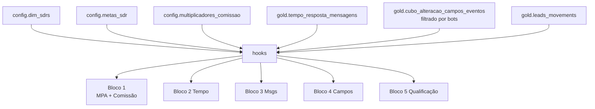

# Dashboard — Desempenho SDR

MPA (Meta de Performance do Atendimento) + comissão individual dos SDRs, apoiado em 4 métricas de execução (tempo de resposta, mensagens/dia, campos/dia, conversão) contra metas por nível.

## Rota

`/comercial/desempenho-sdr` — perfil `gestor`.

## Estrutura de arquivos

```
src/areas/comercial/desempenho-sdr/
├── pages/Dashboard.tsx
├── hooks/useDesempenhoSDR.ts
├── types.ts
└── components/
    ├── _helpers.ts
    ├── Bloco1Geral.tsx
    ├── Bloco2TempoResposta.tsx
    ├── Bloco3Mensagens.tsx
    ├── Bloco4Campos.tsx
    └── Bloco5Qualificacao.tsx
```

## Hooks e fontes de dados

### `useSDRs()` — `config.dim_sdrs`

```ts
await supabase.schema('config').from('dim_sdrs').select('*').order('nome');
```
Retorna todos os SDRs (ativos e históricos). Cache 30min.

### `useMetasSDR()` — `config.metas_sdr`

```ts
await supabase.schema('config').from('metas_sdr').select('*');
```
4 linhas (uma por nível). Cache 30min.

### `useMultiplicadores()` — `config.multiplicadores_comissao`

```ts
await supabase.schema('config').from('multiplicadores_comissao')
  .select('*').order('mpa_min');
```
Faixas `mpa_min` → `mpa_max` → `multiplicador`. Cache 30min.

### `useMensagensSDR(dateFrom, dateTo)` — `gold.tempo_resposta_mensagens`

```ts
await supabase
  .schema('gold')
  .from('tempo_resposta_mensagens')
  .select('responder_user_id, responder_user_name, received_at, responded_at, ' +
          'response_minutes, faixa, lead_id')
  .eq('recebida_dentro_janela', true)
  .gte('received_at', dateFrom)
  .lte('received_at', dateTo + 'T23:59:59')
  .range(from, from + 999);
```

### `useAlteracoesSDR(dateFrom, dateTo)` — `gold.cubo_alteracao_campos_eventos`

```ts
await supabase
  .schema('gold')
  .from('cubo_alteracao_campos_eventos')
  .select('lead_id, criado_por_id, criado_por, data_criacao, dentro_janela, campo_id')
  .eq('dentro_janela', true)
  .not('campo_id', 'in', '(851177,850685,850687,853875,849769,586018)')   // ⚠ excluir bots
  .gte('data_criacao', dateFrom)
  .lte('data_criacao', dateTo + 'T23:59:59')
  .range(from, from + 999);
```

Ver [business-rules.md → Campos Automatizados Excluídos](../business-rules.md#campos-automatizados-excluídos).

### `useMovimentosSDR(dateFrom, dateTo)` — `gold.leads_movements`

```ts
await supabase
  .schema('gold')
  .from('leads_movements')
  .select('lead_id, pipeline_from, pipeline_to, status_to, moved_by, moved_by_id, moved_at')
  .gte('moved_at', dateFrom)
  .lte('moved_at', dateTo + 'T23:59:59')
  .range(from, from + 999);
```

## Helpers — [`components/_helpers.ts`](../../src/areas/comercial/desempenho-sdr/components/_helpers.ts)

- `getActiveSdrs(sdrs, from, to)` — filtra SDRs cuja `vigencia_inicio` ≤ `to` e (`vigencia_fim` ≥ `from` OU null), e `ativo = true`
- `countWeekdays(from, to)` — dias úteis (seg-sex) no intervalo
- `toLocalDateKey(d)` — `'YYYY-MM-DD'`
- `toWeekKey(d)` — `'YYYY-Www'` (ISO week)
- `datesBetween(from, to)` — array de Date
- `shortDay(key)` — `'dd/MM'`

## Filtros da tela

- **SDRs** (multi-select) — apenas os ativos (`dim_sdrs.ativo = true`)
- **Período** — date range picker, padrão: mês atual

## Abas

| Id | Label | Componente |
|---|---|---|
| `geral` | Desempenho Geral | `Bloco1Geral` |
| `tempo` | Tempo Resposta | `Bloco2TempoResposta` |
| `msg` | Mensagens | `Bloco3Mensagens` |
| `campos` | Campos Alterados | `Bloco4Campos` |
| `qual` | Qualificação | `Bloco5Qualificacao` |

---

## Bloco 1 — Desempenho Geral

[`components/Bloco1Geral.tsx`](../../src/areas/comercial/desempenho-sdr/components/Bloco1Geral.tsx)

Para cada SDR ativo no período, computa o MPA e a comissão.

### Cálculo por SDR (linha 70-159)

```ts
// 1. exec_tempo — nota 0-1
const faixaCounts = count mensagens por faixa para msgs onde responder_user_name === sdr.nome
exec_tempo = calcNotaTempo(faixaCounts)

// 2. exec_msg — média diária
const msgsEnviadas = count mensagens do SDR em dia útil
const diasComMsg   = count DISTINCT date onde teve ≥1 msg (só dias úteis)
exec_msg = msgsEnviadas / diasComMsg

// 3. exec_campos — média diária
const altsSDR     = count alterações do SDR (campos filtrados, dentro_janela)
const diasComAlt  = count DISTINCT date
exec_campos = altsSDR / diasComAlt

// 4. exec_conv — taxa % do SDR
const leadsRecebidos = set(lead_id) onde movimentos ao pipeline 'Recepção Leads Insta' no período
const leadsQualificadosSDR = set(lead_id) onde:
  movimento foi feito pelo SDR E
  (pipeline_from='Recepção Leads Insta' AND pipeline_to='Vendas WhatsApp')
  OU isQualificadoSDR(status_to)
  E lead_id ∈ leadsRecebidos   // ← correção para evitar >100%
exec_conv = (|leadsQualificadosSDR| / |leadsRecebidos|) * 100

// 5. MPA
mpa = calcMPA(exec_tempo, meta.meta_tempo_resposta,
              exec_msg,    meta.meta_msg_diaria,
              exec_campos, meta.meta_campos_diarios,
              exec_conv,   meta.meta_conversao)

// 6. Multiplicador + Comissão
mult     = calcMultiplicador(mpa, multiplicadores)
comissao = meta.comissao_variavel_base * mult
```

Ver fórmulas: [business-rules.md → MPA](../business-rules.md#mpa--meta-de-performance-do-atendimento-sdr) e [Multiplicador](../business-rules.md#multiplicador-de-comissão-sdr).

### KPIs gerais do time (no topo)

- Nota Geral do Time (tempo) — média das notas individuais
- Total Mensagens Enviadas
- Total Alterações de Campo
- Taxa de Conversão Geral

### Tabela — Performance por SDR

| Coluna | Cálculo |
|---|---|
| SDR | `sdr.nome` |
| Nível | `sdr.nivel` |
| Nota Tempo | `exec_tempo * 100 %` — colorido (vermelho baixo → verde alto) |
| Msg Diária | `exec_msg` (1 decimal) |
| Campos Diários | `exec_campos` (1 decimal) |
| Taxa Conv. | `exec_conv %` |
| MPA | `mpa %` |
| Multiplicador | `mult` (2 decimais) |
| Comissão | `comissao` em R$ |

Ordenação: MPA DESC.

---

## Bloco 2 — Tempo Resposta

[`components/Bloco2TempoResposta.tsx`](../../src/areas/comercial/desempenho-sdr/components/Bloco2TempoResposta.tsx)

### KPI: Nota Geral do Time
`avg(notaIndividual)` entre SDRs ativos

### KPI: Total de Mensagens Avaliadas
`count(mensagens onde recebida_dentro_janela)`

### BarChart: Distribuição do time por faixa
5 barras (< 5 min, < 10 min, < 15 min, < 30 min, > 30 min) com total de mensagens em cada.

### Tabela: Nota por SDR
| Coluna | Cálculo |
|---|---|
| SDR | `responder_user_name` |
| Nota | `calcNotaTempo(distribuição individual)` |
| Mensagens | count do SDR |

Ordenada por Nota DESC.

### BarChart empilhado (100%): Distribuição por faixa por SDR
Para cada SDR, uma barra horizontal 100% stacked mostrando o mix de faixas (< 5 min até > 30 min). Cores progressivas verde → vermelho.

---

## Bloco 3 — Mensagens

[`components/Bloco3Mensagens.tsx`](../../src/areas/comercial/desempenho-sdr/components/Bloco3Mensagens.tsx)

### KPIs
- Total Mensagens
- Mensagens Diárias (média do time) = `total / dias úteis`
- Mensagens por Lead (média do time) = `total / count(distinct lead_id)`

### Tabela: Médias Diárias por SDR
| Coluna | Cálculo |
|---|---|
| SDR | nome |
| Total | count msgs do SDR |
| Dias Úteis | count dias úteis que teve ≥1 msg |
| Média Diária | total / dias |

### Tabela: Mensagens por Lead por SDR
| Coluna | Cálculo |
|---|---|
| SDR | nome |
| Total | count msgs |
| Leads Distintos | count(distinct `lead_id`) |
| Média por Lead | `total / leads_distintos` |

**⚠ Atenção:** "Média Diária" ≠ "Média por Lead". A primeira divide pelo nº de dias; a segunda pelo nº de leads únicos que receberam msg.

### BarChart: Evolução semanal de mensagens
Para cada SDR nos top 5 em volume, série linha com mensagens por semana ISO (`YYYY-Www`).

---

## Bloco 4 — Campos Alterados

[`components/Bloco4Campos.tsx`](../../src/areas/comercial/desempenho-sdr/components/Bloco4Campos.tsx)

Todas as contagens já excluem os 6 campos-bot via query (ver [`useAlteracoesSDR`](#useadvsdr-dateto-golecubo_alteracao_campos_eventos)).

### KPIs
- Total Alterações
- Média Diária do time = `total / dias úteis`

### Tabela: Alterações por SDR
| Coluna | Cálculo |
|---|---|
| SDR | nome |
| Total | count |
| % do Total | `(total_sdr / total_time) * 100` |

### Tabela: Média Diária por SDR
| Coluna | Cálculo |
|---|---|
| SDR | nome |
| Total | count |
| Dias com alteração | count distinct date |
| Média Diária | total / dias |

### BarChart agrupado mensal: Alterações mensais por SDR (top 8)
Eixo X = mês/ano; cada SDR é uma barra colorida.

---

## Bloco 5 — Qualificação

[`components/Bloco5Qualificacao.tsx`](../../src/areas/comercial/desempenho-sdr/components/Bloco5Qualificacao.tsx)

### Conceitos

**`leadsRecebidos`** (set) — leads únicos que entraram em `Recepção Leads Insta` no período:
```ts
movs.filter(m => m.pipeline_to === 'Recepção Leads Insta')
    .map(m => m.lead_id)
    // → Set
```

**`movimentosQualificacao`** — movimentos do período onde:
```ts
isQualificadoSDR(status_to) ||
  (pipeline_from === 'Recepção Leads Insta' && pipeline_to === 'Vendas WhatsApp')
```

`isQualificadoSDR(status)` = `status?.startsWith('Qualificado SDR')` (em [types.ts](../../src/areas/comercial/desempenho-sdr/types.ts)).

**`leadsQualificados`** (set) — apenas os `movimentosQualificacao.lead_id` que também estão em `leadsRecebidos`:

```ts
leadsQualificados = new Set<number>();
for (const m of movimentosQualificacao) {
  if (leadsRecebidos.has(m.lead_id)) leadsQualificados.add(m.lead_id);
}
```

Isso corrige o bug histórico onde a taxa podia passar de 100% (leads qualificados no período mas recebidos fora).

### KPIs
- Leads Recebidos: `|leadsRecebidos|`
- Leads Qualificados: `|leadsQualificados|`
- Taxa de Qualificação: `(qualificados / recebidos) * 100`

### Tabela por SDR
| Coluna | Cálculo |
|---|---|
| SDR | nome |
| Qualificados | count de leads qualificados movidos por esse SDR (que também estão em `leadsRecebidos`) |
| Taxa | `(qualificados_sdr / recebidos) * 100` (denominador é total do time, não só os leads atribuídos) |

---

## Diagrama



## Notas

- **SDR em férias/desligado** deixa de aparecer quando `ativo = false` em `dim_sdrs`.
- **Metas** são por nível, não por SDR individual. Um SDR promovido de Junior 01 para Junior 02 passa a ter a meta mais alta.
- **Comissão** é variável e multiplicativa: uma MPA de 105% com `comissao_variavel_base = R$ 1.000` dá `R$ 1.050` (pela regra `mpa > 100 ⇒ mult = mpa / 100`).
