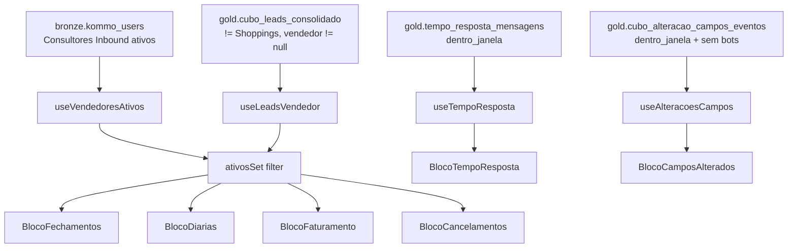

# Dashboard — Desempenho Vendedor

Seis blocos de análise do desempenho operacional dos Consultores Inbound (vendedores): tempo de resposta, campos alterados, fechamentos, diárias, faturamento e cancelamentos.

## Rota

`/comercial/desempenho-vendedor` — perfil `gestor`.

## Estrutura de arquivos

```
src/areas/comercial/desempenho-vendedor/
├── pages/Dashboard.tsx
├── hooks/useDesempenhoVendedor.ts
├── types.ts
└── components/
    ├── BlocoTempoResposta.tsx
    ├── BlocoCamposAlterados.tsx
    ├── BlocoFechamentos.tsx
    ├── BlocoDiarias.tsx
    ├── BlocoFaturamento.tsx
    └── BlocoCancelamentos.tsx
```

## Hooks

### `useVendedoresAtivos()` — vendedores ativos

```ts
await supabase
  .schema('bronze')
  .from('kommo_users')
  .select('name')
  .eq('is_active', true)
  .eq('group_name', 'Consultores Inbound')
  .order('name');
```
Retorna `string[]` com nomes. Cache 30min.

### `useLeadsVendedor()` — leads com `vendedor` preenchido

```ts
await supabase
  .schema('gold')
  .from('cubo_leads_consolidado')
  .select('id_lead, nome_lead, valor_total, vendedor, funil_atual, estagio_atual, ' +
          'data_de_fechamento, data_e_hora_do_agendamento, data_cancelamento, ' +
          'data_criacao, numero_de_diarias, tipo_lead, status_lead, cancelado')
  .not('vendedor', 'is', null)
  .neq('tipo_lead', 'Shoppings')
  .range(from, from + 999);
```

Cache 5min. Paginado.

### `useTempoResposta(dateFrom, dateTo)` — mensagens por vendedor

```ts
await supabase
  .schema('gold')
  .from('tempo_resposta_mensagens')
  .select('responder_user_id, responder_user_name, received_at, responded_at, ' +
          'response_minutes, faixa, recebida_dentro_janela')
  .eq('recebida_dentro_janela', true)
  .gte('received_at', dateFrom)
  .lte('received_at', dateTo + 'T23:59:59')
  .range(from, from + 999);
```

### `useAlteracoesCampos(dateFrom, dateTo)` — campos alterados

```ts
await supabase
  .schema('gold')
  .from('cubo_alteracao_campos_eventos')
  .select('lead_id, criado_por_id, criado_por, data_criacao, dentro_janela')
  .eq('dentro_janela', true)
  .not('campo_id', 'in', '(851177,850685,850687,853875,849769,586018)')   // ⚠ excluir bots
  .gte('data_criacao', dateFrom)
  .lte('data_criacao', dateTo + 'T23:59:59')
  .range(from, from + 999);
```

## Filtros da tela

- **Vendedores** (multi-select) — apenas `Consultores Inbound` ativos (via `useVendedoresAtivos`)
- **Período** — date range, padrão: mês atual

Aplicação do filtro em `Dashboard.tsx`:
```ts
const ativosSet = new Set(vendedoresAtivos);
const filteredLeads = leads.filter(l => l.vendedor && ativosSet.has(l.vendedor));
if (filters.vendedores.length > 0) {
  filteredLeads = filteredLeads.filter(l => filters.vendedores.includes(l.vendedor));
}
```

**"Não atribuído"** nunca aparece — já é filtrado no `.not('vendedor','is',null)` + o `ativosSet` restringe a vendedores ativos conhecidos.

## Abas

| Id | Label | Componente |
|---|---|---|
| `tempo` | Tempo Resposta | `BlocoTempoResposta` |
| `campos` | Campos Alterados | `BlocoCamposAlterados` |
| `fechamentos` | Fechamentos | `BlocoFechamentos` |
| `diarias` | Diárias | `BlocoDiarias` |
| `faturamento` | Faturamento | `BlocoFaturamento` |
| `cancelamentos` | Cancelamentos | `BlocoCancelamentos` |

---

## BlocoTempoResposta

[`components/BlocoTempoResposta.tsx`](../../src/areas/comercial/desempenho-vendedor/components/BlocoTempoResposta.tsx)

Estruturalmente igual ao Bloco 2 de SDR.

### KPI: Nota Geral do Time
`avg(notaIndividual)` entre vendedores ativos que responderam ≥1 mensagem.

### KPI: Total de Mensagens Avaliadas

### BarChart: Distribuição do time por faixa
5 barras (faixas de tempo).

### Tabela: Nota por Vendedor
| Coluna | Cálculo |
|---|---|
| Vendedor | `responder_user_name` |
| Nota | `calcNotaTempo(distribuição)` |
| Mensagens | count |

### BarChart empilhado (100%): Distribuição por faixa por vendedor
Mesma visualização do bloco de SDR (barras horizontais 100% stacked com cores verde → vermelho).

---

## BlocoCamposAlterados

[`components/BlocoCamposAlterados.tsx`](../../src/areas/comercial/desempenho-vendedor/components/BlocoCamposAlterados.tsx)

Base: `gold.cubo_alteracao_campos_eventos` já filtrada (6 bots excluídos), janela de horário comercial.

### KPIs (3 cards)
- **Média por Vendedor** — `total_alteracoes / num_vendedores`
- **Média Diária** — `total_alteracoes / dias_com_alteracao`
- **Média por Lead** — `total_alteracoes / leads_distintos`

### Tabela: Total por Vendedor
| Coluna | Cálculo |
|---|---|
| Vendedor | `normalizeUserName(criado_por)` |
| Total de Alterações | count |
| % do Total | `(total_vendedor / total_time) * 100` |

### Tabela: Média Diária por Vendedor
| Coluna | Cálculo |
|---|---|
| Total | count |
| Dias com Alteração | count distinct date |
| Média Diária | total / dias |

### Tabela: Média por Lead
| Coluna | Cálculo |
|---|---|
| Total | count |
| Leads Alterados | count distinct `lead_id` |
| Média por Lead | total / leads |

### BarChart mensal agrupado (top 8 vendedores)
X: `Mês/AA`. Cada vendedor é uma barra colorida agrupada no mês.

---

## BlocoFechamentos

[`components/BlocoFechamentos.tsx`](../../src/areas/comercial/desempenho-vendedor/components/BlocoFechamentos.tsx)

### Helper `filterLeadsFechados(leads, dateFrom, dateTo)`

```ts
const FUNIS_FECHADOS = ['Onboarding Escolas', 'Onboarding SME',
                        'Financeiro', 'Clientes - CS', 'Shopping Fechados'];
// (Shopping Fechados aparece em FUNIS_FECHADOS mas tipo_lead='Shoppings' já foi excluído no hook)

leads.filter(l =>
  l.funil_atual IN FUNIS_FECHADOS &&
  l.status_lead === 'Venda Fechada' &&
  l.data_de_fechamento != null &&
  inRange(l.data_de_fechamento, dateFrom, dateTo)
);
// + dedup: última passagem por id_lead (maior data_de_fechamento)
```

### KPI: Total de Leads Fechados

### Stacked BarChart (vertical): Fechamentos por Mês (top 8 vendedores)
- **X:** `Mês/AA`
- **Y:** count de leads
- **Series:** top 8 vendedores em volume; cores distintas

### Horizontal BarChart: Total por Vendedor
- Contagem por vendedor, ordenado DESC

---

## BlocoDiarias

[`components/BlocoDiarias.tsx`](../../src/areas/comercial/desempenho-vendedor/components/BlocoDiarias.tsx)

Mesmo conjunto de filtros de `filterLeadsFechados`.

### KPIs
- Total de Diárias (Σ `parseInt(numero_de_diarias)`)
- Ticket Médio (ver [business-rules.md](../business-rules.md#ticket-médio-por-diária))

### Horizontal BarChart: Diárias por Vendedor
Soma `numero_de_diarias` por vendedor, ordenada DESC.

### BarChart mensal: Diárias por mês
`Σ numero_de_diarias` agrupado por `YYYY-MM(data_de_fechamento)`.

---

## BlocoFaturamento

[`components/BlocoFaturamento.tsx`](../../src/areas/comercial/desempenho-vendedor/components/BlocoFaturamento.tsx)

Dois pontos de vista:

### VIEW A — "Valor Vendido" (filtra por `data_de_fechamento`)

```ts
viewALeads = leads.filter(l =>
  l.vendedor != null &&
  l.data_de_fechamento != null &&
  inRange(l.data_de_fechamento, dateFrom, dateTo)
);
```

- **KPI Valor Vendido no Período** — `Σ valor_total`
- **KPI Diárias Fechadas** — `Σ parseInt(numero_de_diarias)`; rodapé mostra Ticket Médio = `valor_vendido / diarias`
- **BarChart horizontal: Valor Vendido por Vendedor** — `Σ valor_total` por vendedor, formato K/M

### VIEW B — "Faturamento Geral" (filtra por `data_e_hora_do_agendamento`)

```ts
viewBLeads = leads.filter(l =>
  l.data_e_hora_do_agendamento != null &&
  inRange(l.data_e_hora_do_agendamento, dateFrom, dateTo)
);
```

- **KPI Faturamento no Período** — `Σ valor_total`
- **KPI Leads com Agendamento** — `count(*)` + Ticket Médio = `fat/leads`
- **BarChart mensal (Mês/AA):** Faturamento Mensal por mês do agendamento

**Diferença chave:** View A é "o vendedor vendeu no período" (data da venda); View B é "o faturamento vai acontecer no período" (data do evento).

---

## BlocoCancelamentos

[`components/BlocoCancelamentos.tsx`](../../src/areas/comercial/desempenho-vendedor/components/BlocoCancelamentos.tsx)

### Lógica de base (corrige bug anterior)

```ts
// NÃO usa filterLeadsFechados (que filtrava status_lead='Venda Fechada')
// porque cancelados têm status_lead='Cancelado' em cubo_leads_consolidado

const FUNIS = ['Onboarding Escolas', 'Onboarding SME',
               'Financeiro', 'Clientes - CS', 'Shopping Fechados'];

allFechados = leads.filter(l =>
  FUNIS.includes(l.funil_atual) &&
  l.nome_lead != null && l.nome_lead !== '' &&
  l.data_de_fechamento != null &&
  l.vendedor != null && l.vendedor !== ''
);
// dedup por id_lead (última passagem)
```

Isso inclui leads `status_lead='Cancelado'`, que é o alvo do bloco.

### KPIs
- Taxa de Cancelamento do time = `count(cancelado=true) / count(total) * 100`
- Total Cancelados

### Tabela por Vendedor
| Coluna | Cálculo |
|---|---|
| Vendedor | `vendedor` |
| Fechados | count |
| Cancelados | count `cancelado=true` |
| Taxa | `(cancelados / fechados) * 100` |

### BarChart: Cancelamentos por Mês
Por `YYYY-MM(data_cancelamento)`.

---

## Diagrama



## Notas

- **Ticket Médio** usa diárias, não leads (diretiva comercial — cobramos por diária).
- **Cancelamentos** precisam de lógica custom porque `cubo_leads_consolidado.status_lead` diferencia `'Cancelado'` de `'Venda Fechada'`.
- **Shopping Fechados** está em `FUNIS_FECHADOS` para algumas contagens, mas o filtro `tipo_lead != 'Shoppings'` no hook já removeu a maioria. A sobreposição é defensiva.
