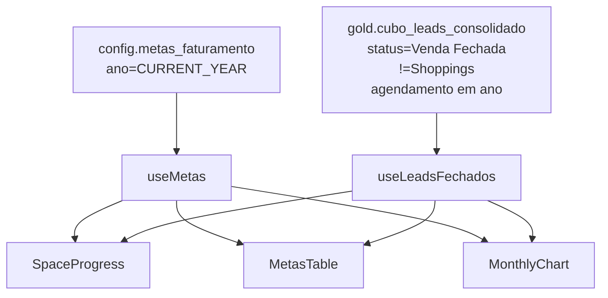

# Dashboard — Faturamento

Progresso anual de faturamento contra metas mensais, apresentado com temática espacial (foguete Terra → Lua) + gráfico mensal composto.

## Rota

`/financeiro/faturamento` — perfil `financeiro`.

## Estrutura de arquivos

```
src/areas/financeiro/
├── pages/Dashboard.tsx
├── hooks/useFaturamento.ts
└── components/
    ├── SpaceProgress.tsx
    ├── MonthlyChart.tsx
    ├── MetasTable.tsx
    └── GaugeChart.tsx
```

## Fonte de dados

Dois hooks em [`hooks/useFaturamento.ts`](../../src/areas/financeiro/hooks/useFaturamento.ts).

### `useMetas()` — [`config.metas_faturamento`](../data-model.md#configmetas_faturamento-12-linhas-por-ano)

```ts
await supabase
  .schema('config')
  .from('metas_faturamento')
  .select('*')
  .eq('ano', CURRENT_YEAR)
  .order('mes');
```

Retorna 12 linhas (mes = 1..12) com `meta_70`, `meta_80`, `meta_90`, `meta_100` em R$.

**Cache:** 30min.

### `useLeadsFechados()` — leads do ano corrente

```ts
await supabase
  .schema('gold')
  .from('cubo_leads_consolidado')
  .select('id_lead, valor_total, data_de_fechamento, data_e_hora_do_agendamento, vendedor, tipo_lead')
  .eq('status_lead', 'Venda Fechada')
  .not('nome_lead', 'is', null)
  .not('data_e_hora_do_agendamento', 'is', null)
  .neq('tipo_lead', 'Shoppings')
  .gte('data_e_hora_do_agendamento', `${CURRENT_YEAR}-01-01`)
  .lte('data_e_hora_do_agendamento', `${CURRENT_YEAR}-12-31T23:59:59`)
  .range(from, from + 999);
```

**⚠️ Importante:** o dashboard filtra por **`data_e_hora_do_agendamento`** (data do evento), não `data_de_fechamento` (data da venda). A lógica é que o faturamento acontece quando o evento é realizado.

**Paginação:** 1000. **Dedup:** última passagem por `id_lead`. **Cache:** 5min.

## Filtros da tela

Sem filtros explícitos — sempre exibe o ano corrente completo.

## Visuais

### KPI: Faturamento Acumulado (Ano)

- **Tipo:** KPI card (grande)
- **Fórmula:** `Σ (l.valor_total || 0)` para todos os leads do ano
- **Formato:** BRL

### Space Progress — [`components/SpaceProgress.tsx`](../../src/areas/financeiro/components/SpaceProgress.tsx)

Componente SVG customizado temático.

**Layout:**

```
[Terra] —— [70%] —— [80%] —— [90%] —— [100%] —— [Lua]
         🚀 (foguete na posição proporcional ao progresso)
```

**Fórmulas:**
```ts
progress = Math.min(valor_atual / meta_100, 1.05);  // cap em 105% para acomodar overshoot
pct = progress * 100;
```

**Milestones (planetas):**
| % | Cor atingida | Cor não-atingida |
|---|---|---|
| 70% | vermelho `#ef4444` | cinza opaco |
| 80% | amarelo `#eab308` | cinza opaco |
| 90% | verde `#22c55e` | cinza opaco |
| 100% | verde escuro `#15803d` | cinza opaco |

**Elementos animados:**
- Foguete com chamas animadas
- Astronauta flutuando
- Estrelas de fundo
- Lua com bandeira vermelha (meta final)

**`meta_100` do ano** = `Σ (metas_faturamento.meta_100) WHERE ano = CURRENT_YEAR`.

### MetasTable — [`components/MetasTable.tsx`](../../src/areas/financeiro/components/MetasTable.tsx)

Tabela compacta com 4 linhas (uma por meta):

| Meta | Valor (R$) | Status (%) |
|---|---|---|
| Meta 70% | `Σ meta_70` | `(faturamento / meta) * 100` |
| Meta 80% | `Σ meta_80` | idem |
| Meta 90% | `Σ meta_90` | idem |
| Meta 100% | `Σ meta_100` | idem |

### MonthlyChart — [`components/MonthlyChart.tsx`](../../src/areas/financeiro/components/MonthlyChart.tsx)

**Tipo:** ComposedChart (BarChart + 4 LineCharts)

**Eixo X:** meses (Jan-Dez)
**Eixo Y:** R$

**Série 1 — Faturamento (Bar):**
- Dado: `Σ valor_total` agrupado por `EXTRACT(MONTH FROM data_e_hora_do_agendamento)`
- Cor: roxo `#A78BFA`
- Labels: valores acima das barras (formatados curto: K/M)

**Séries 2-5 — Metas (Line tracejada):**

| Série | Cor | Fonte |
|---|---|---|
| Meta 70% | `#ef4444` | `metas_faturamento.meta_70` |
| Meta 80% | `#eab308` | `metas_faturamento.meta_80` |
| Meta 90% | `#22c55e` | `metas_faturamento.meta_90` |
| Meta 100% | `#15803d` | `metas_faturamento.meta_100` |

**Tooltip:** formato BRL completo.

### GaugeChart — [`components/GaugeChart.tsx`](../../src/areas/financeiro/components/GaugeChart.tsx)

Componente genérico usado opcionalmente para mostrar KPI em formato de medidor semicircular. Uso específico depende do `Dashboard.tsx`.

## Diagrama



## Notas

- **Shopping Fechados** está excluído via `tipo_lead != 'Shoppings'`.
- **`data_e_hora_do_agendamento`** é usada para filtrar, não `data_de_fechamento`. Um lead fechado em dezembro/2025 com evento em fevereiro/2026 aparece no faturamento de 2026.
- **Metas** são manuais — editadas diretamente em `config.metas_faturamento` via SQL. Não há UI de edição.
