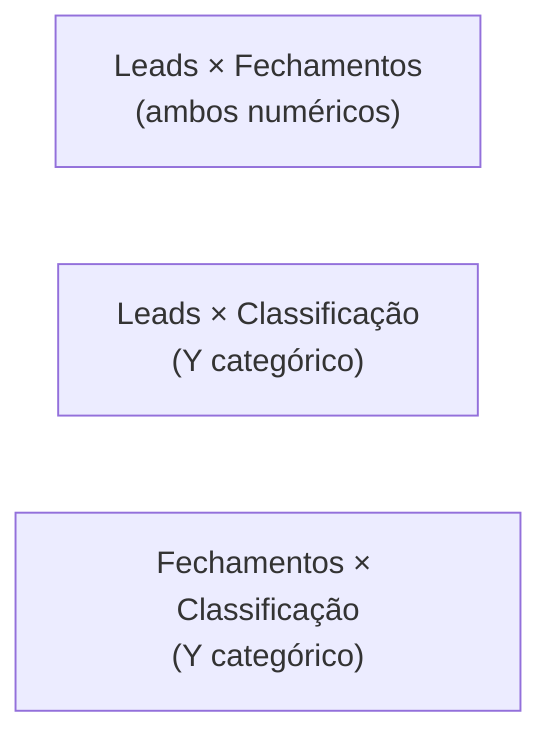
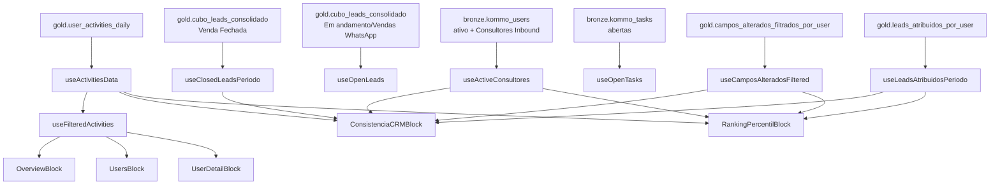

# Dashboard — Monitoramento de Usuários

Atividades dos usuários do CRM (SDRs + Consultores Inbound) — visão geral, detalhamento individual, consistência no uso do CRM e ranking por percentil.

## Rota

`/comercial/monitoramento` — perfil `gestor`.

## Estrutura de arquivos

```
src/areas/comercial/monitoramento/
├── pages/Dashboard.tsx
├── hooks/
│   ├── useActivitiesData.ts
│   └── useConsistenciaData.ts
├── types.ts
└── components/
    ├── MonitoringFilterBar.tsx
    ├── OverviewBlock.tsx
    ├── UsersBlock.tsx
    ├── UserDetailBlock.tsx
    ├── ConsistenciaCRMBlock.tsx
    ├── RankingPercentilBlock.tsx
    └── HourlyBlock.tsx
```

## Hooks

### `useActivitiesData(filters)` — fonte principal

[`hooks/useActivitiesData.ts`](../../src/areas/comercial/monitoramento/hooks/useActivitiesData.ts)

```ts
await supabase
  .schema('gold')
  .from('user_activities_daily')
  .select('*')
  .gte('activity_date', dateFromStr)
  .lte('activity_date', dateToStr)
  .range(from, from + 999);
```

Default period: mês atual (`startOfMonth(now)` até hoje). Paginado. Cache 5min.

**Interface `UserActivity`:** `user_id, user_name, role_name, activity_date, activity_hour, event_type, category, entity_type, activity_count`.

### `useFilteredActivities(activities, filters)` — filtro em JS

Aplica `filters.users`, `filters.categories`, `filters.roles`.

### Hooks de `useConsistenciaData.ts`

Consumidos apenas por `ConsistenciaCRMBlock` e `RankingPercentilBlock`.

#### `useActiveConsultores()`
```ts
await supabase.schema('bronze').from('kommo_users')
  .select('id, name, group_name')
  .eq('is_active', true).eq('group_name', 'Consultores Inbound')
  .order('name');
```

#### `useOpenLeads()` — snapshot de leads abertos em Vendas WhatsApp
```ts
await supabase.schema('gold').from('cubo_leads_consolidado')
  .select('id_lead, vendedor, funil_atual, estagio_atual')
  .eq('status_lead', 'Em andamento')
  .eq('funil_atual', 'Vendas WhatsApp')
  .not('vendedor', 'is', null);
```

#### `useClosedLeadsPeriodo(dateFrom, dateTo)`
```ts
await supabase.schema('gold').from('cubo_leads_consolidado')
  .select('vendedor, data_de_fechamento, numero_de_diarias')
  .eq('status_lead', 'Venda Fechada')
  .not('vendedor', 'is', null)
  .not('data_de_fechamento', 'is', null)
  .gte('data_de_fechamento', dateFrom)
  .lte('data_de_fechamento', dateTo + 'T23:59:59');
```

#### `useOpenTasks()`
```ts
await supabase.schema('bronze').from('kommo_tasks')
  .select('id, entity_id, responsible_user_id, is_completed, complete_till')
  .eq('is_completed', false)
  .eq('entity_type', 'leads');
```

#### `useCamposAlteradosFiltered(dateFrom, dateTo)` — via RPC
```ts
await supabase.schema('gold').rpc('campos_alterados_filtrados_por_user', {
  p_from: dateFrom + 'T00:00:00Z',
  p_to:   dateTo   + 'T23:59:59Z',
});
```

Retorna `{user_id → count}` com os 6 bots excluídos.

#### `useLeadsAtribuidosPeriodo(dateFrom, dateTo)` — via RPC
```ts
await supabase.schema('gold').rpc('leads_atribuidos_por_user', {
  p_from, p_to,
});
```

Retorna `{user_id → count}` de leads atribuídos no período (dupla contagem). Ver [data-model.md → `leads_atribuidos_por_user`](../data-model.md#goldleads_atribuidos_por_userp_from-p_to--tableuser_id-leads).

## Filtros da tela — [`MonitoringFilterBar.tsx`](../../src/areas/comercial/monitoramento/components/MonitoringFilterBar.tsx)

- Usuários (multi)
- Categorias (multi)
- Papéis/Roles (multi): `SDR`, `Consultores Inbound`
- Período (padrão: mês atual)

## Abas

| Id | Label | Componente |
|---|---|---|
| `overview` | Visão Geral | `OverviewBlock` |
| `categories` | Por Categoria | `UsersBlock` |
| `user-detail` | Por Usuário | `UserDetailBlock` |
| `consistencia` | Consistência CRM | `ConsistenciaCRMBlock` |
| `ranking` | Ranking por Percentil | `RankingPercentilBlock` |

---

## OverviewBlock — [`components/OverviewBlock.tsx`](../../src/areas/comercial/monitoramento/components/OverviewBlock.tsx)

Consome `filtered` (já com user/category/role filter aplicado).

### KPIs (4 cards)
| KPI | Fórmula |
|---|---|
| Total Atividades | `Σ activity_count` |
| Usuários Ativos | `count distinct user_id` |
| Média por Usuário | `total / users` |
| Média por Dia | `total / dias_distintos` |

### BarChart horizontal: Atividades por Categoria
- `Σ activity_count` agrupado por `category`
- **Exclui** `'Tag'` e `'Vinculacao'` (categorias residuais)
- Cores: `CATEGORY_COLORS`

---

## UsersBlock — [`components/UsersBlock.tsx`](../../src/areas/comercial/monitoramento/components/UsersBlock.tsx)

Estatísticas por categoria, com breakdown por tipo de evento.

### Distribuição Detalhada por `event_type`

Cada linha da tabela é um `event_type` (`outgoing_chat_message`, `task_added`, `task_completed`, etc.). Mostra contagem total e top usuários.

---

## UserDetailBlock — [`components/UserDetailBlock.tsx`](../../src/areas/comercial/monitoramento/components/UserDetailBlock.tsx)

Análise individual profunda de **1 usuário**. O seletor interno foi removido — **usa o filtro global de Usuário**.

### Regra de entrada

```ts
const selectedUser = selectedUsers.length === 1 ? selectedUsers[0] : '';
```

- Se **0 ou >1 usuários** no filtro global: mostra aviso "Para a análise individual, precisa deixar apenas 1 seleção no filtro de Usuário".
- Se **exatamente 1**: renderiza análise.

### KPIs (4 cards)

| KPI | Cálculo |
|---|---|
| Total Atividades | `Σ activity_count` do usuário |
| Média por Dia | `total / dias_ativos` |
| Dias Ativos | `count distinct activity_date` |
| Categoria Principal | `top category by activity_count` |

Comparações:
- **vs. período anterior**: `(atual - anterior) / anterior * 100 %`
- **vs. média do grupo (mesmo role)**: `(atual - avgGrupo) / avgGrupo * 100 %`

### BarChart: Atividades por Semana
`Σ activity_count` agrupado por ISO week.

### BarChart: Média por Hora
`avg(atividade_count)` por `activity_hour`. ReferenceLine tracejada: média do grupo (mesmo role).

### BarChart horizontal: Breakdown por Categoria

---

## ConsistenciaCRMBlock — [`components/ConsistenciaCRMBlock.tsx`](../../src/areas/comercial/monitoramento/components/ConsistenciaCRMBlock.tsx)

Métrica-chave do bloco: **ações/lead** no período.

### Dados consumidos

- `activities` (todas, não filtradas — o filtro só afeta a exibição)
- `selectedUsers` — lista de vendedores do filtro global
- `camposFiltered` — hook RPC, exclui 6 bots
- `leadsAtribuidos` — hook RPC, leads atribuídos no período
- `closedLeads` — fechamentos no período

### Cálculo de `acoesPorVendedor`

```ts
// 1. Soma activity_count de todas as categorias, EXCETO 4 excluídas:
const EXCLUDED = ['Tag', 'Vinculacao', 'Outros', 'Campo alterado'];
for (const a of activities) {
  if (EXCLUDED.has(a.category)) continue;
  acoes[a.user_id] += a.activity_count;
}
// 2. Adiciona campos alterados filtrados (pela RPC, só humanos):
for (const [uid, count] of Object.entries(camposFiltered)) {
  acoes[Number(uid)] += count;
}
```

Por que excluir `'Campo alterado'` acima? Porque vem de `user_activities_daily`, que **não** exclui os 6 bots — usamos a RPC filtrada em substituição.

### Cálculo de `acoes_por_lead` (score)

```ts
const leadsPeriodo = leadsAtribuidos[u.id] || 0;
const acoesPorLead = leadsPeriodo > 0 ? acoes / leadsPeriodo : 0;
const classificacao = classifyConsistencia(acoesPorLead);
// classifyConsistencia:
// >= 3.0  → 'Boa'
// >= 1.5  → 'Moderada'
// >= 0.7  → 'Baixa'
// < 0.7   → 'Extremamente Baixa'
```

### Separação computação × exibição

```ts
allRows = computa para TODOS os consultores ativos
rows    = selectedUsers.length === 0 ? allRows : allRows.filter(r => selectedUsers.includes(r.user_name))
```

→ Filtrar um vendedor específico **não** muda a classificação dele (antes do fix, ele virava "Extremamente Baixa" porque os dados dos outros eram descartados pelo `filtered`).

### Info card (topo)

Explica:
- Score = ações/lead
- Leads no período = dupla contagem via RPC
- 4 faixas fixas de classificação
- Categorias contadas/excluídas
- 6 campos bot excluídos

### KPIs (4 cards — distribuição das classificações)
Exibe quantos vendedores em cada faixa (Boa / Moderada / Baixa / Extremamente Baixa).

### Tabela: Consistência por Vendedor

| Coluna | Cálculo |
|---|---|
| Vendedor | `user_name` |
| Leads no Período | `leadsAtribuidos[u.id]` (via RPC) |
| Fechados no Período | count em `closedLeads` |
| Ações no Período | `acoesPorVendedor[u.id]` |
| Ações/Lead | `acoes / leads` |
| Classificação | `classifyConsistencia(ratio)` — badge colorido |

Ordenada por `acoes_por_lead DESC`.

### 3 Scatter Plots



Cada ponto colorido pela classificação do vendedor. Classificação no eixo Y é mapeada para número:

```ts
CLASSIFICACAO_NUM = {
  'Extremamente Baixa': 1,
  'Baixa': 2,
  'Moderada': 3,
  'Boa': 4,
};
```

Eixo Y formatado de volta para string (`CLASSIFICACAO_ORDER`).

**Tooltip custom** mostra: nome, leads, fechamentos e classificação colorida.

---

## RankingPercentilBlock — [`components/RankingPercentilBlock.tsx`](../../src/areas/comercial/monitoramento/components/RankingPercentilBlock.tsx)

Mesma métrica `ações/lead`, mas ranqueada contra percentis do próprio time.

### Cálculo de percentis

```ts
function percentile(sorted: number[], p: number): number {
  const idx = (p / 100) * (sorted.length - 1);
  const lo = Math.floor(idx);
  const hi = Math.ceil(idx);
  if (lo === hi) return sorted[lo];
  return sorted[lo] + (sorted[hi] - sorted[lo]) * (idx - lo);
}

const sortedRates = base.map(b => b.acoes_por_lead).sort((a,b) => a-b);
p25 = percentile(sortedRates, 25);
p50 = percentile(sortedRates, 50);
p75 = percentile(sortedRates, 75);
```

### Faixa (relativa ao time inteiro)

| Condição | Faixa | Cor |
|---|---|---|
| `≥ p75` | Top 25% | verde vivo |
| `≥ p50` | Acima da Mediana | verde |
| `≥ p25` | Abaixo da Mediana | laranja |
| `< p25` | Bottom 25% | vermelho |

### KPIs: P25, P50, P75

### BarChart horizontal: Ações por Lead — Time
- Barra por vendedor, colorida pela faixa
- ReferenceLines tracejadas em P25/P50/P75
- Labels com valor à direita

### Tabela: Ranking Detalhado

| Coluna | Cálculo |
|---|---|
| # | `posicao` (rank por `acoes_por_lead` DESC) |
| Vendedor | `user_name` |
| Ações/Lead | valor (2 decimais) |
| Percentil | `((total - posicao) / (total - 1)) * 100` → P[N] |
| Faixa | badge colorido |

### Separação computação × exibição

```ts
rows (todos, para percentis) → displayedRows (filtrados por selectedUsers)
```

Percentis são sempre calculados sobre o time inteiro; o filtro só esconde linhas.

---

## HourlyBlock — [`components/HourlyBlock.tsx`](../../src/areas/comercial/monitoramento/components/HourlyBlock.tsx)

Componente auxiliar usado em outros blocos para mostrar distribuição horária.

---

## Tipos importantes — [`types.ts`](../../src/areas/comercial/monitoramento/types.ts)

```ts
export const FIM_FUNIL_ESTAGIOS = [
  'Negociação', 'Geladeira', 'Venda provável', 'Falar com Direção/Decisor',
];

export function classifyConsistencia(acoesPorLead: number): ClassificacaoCRM {
  if (acoesPorLead >= 3.0) return 'Boa';
  if (acoesPorLead >= 1.5) return 'Moderada';
  if (acoesPorLead >= 0.7) return 'Baixa';
  return 'Extremamente Baixa';
}

export const CLASSIFICACAO_COLORS: Record<ClassificacaoCRM, string> = {
  'Boa':                 'hsl(142, 60%, 50%)',
  'Moderada':            'hsl(45, 80%, 55%)',
  'Baixa':               'hsl(25, 80%, 55%)',
  'Extremamente Baixa':  'hsl(0, 72%, 51%)',
};
```

## Diagrama



## Notas

- **Consistência CRM** e **Ranking por Percentil** computam sobre o **time inteiro** e só filtram no display — garante que a classificação/percentil de um vendedor individual não se distorça quando filtrado.
- **Cold start**: primeira carga do `leads_atribuidos_por_user` leva ~8s (query reconstrói timelines de responsáveis). Depois cacheia 5min via react-query.
- **`user_activities_daily`** não filtra os 6 campos bot — por isso trocamos a fonte de `'Campo alterado'` pela RPC `campos_alterados_filtrados_por_user`. As demais abas (Overview, Categorias, Detalhe) **ainda** contam os bots em `'Campo alterado'`.
