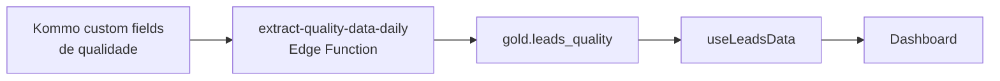

# Dashboard — Qualidade de Atendimento

Avalia a qualidade qualitativa do atendimento dos vendedores com base em 24+ critérios preenchidos por um avaliador humano nos leads do Kommo.

## Rota

`/comercial/qualidade` — perfil `comercial`.

## Estrutura de arquivos

```
src/areas/comercial/qualidade/
├── pages/Dashboard.tsx
├── hooks/useLeadsData.ts
├── types.ts
└── components/
    ├── QualityBlock.tsx
    ├── SellerBlock.tsx
    ├── DiagnosticBlock.tsx
    ├── ContextBlock.tsx
    ├── CommercialBlock.tsx
    └── QualitativeBlock.tsx
```

## Fonte de dados



### Hook `useLeadsData()` — [`hooks/useLeadsData.ts`](../../src/areas/comercial/qualidade/hooks/useLeadsData.ts)

```ts
await supabase
  .schema('gold')
  .from('leads_quality')
  .select('*')
  .order('created_at_kommo', { ascending: false });
```

**Cache:** staleTime 5min, gcTime 10min.

**Interface:** `LeadQuality` (~47 campos — ver [types.ts](../../src/areas/comercial/qualidade/types.ts)).

### Hook `useFilteredLeads(leads, filters)`

Filtra em JS por:
- Vendedor (`vendedor_consultor`)
- Score (`score_qualidade`)
- Data de criação (`created_at_kommo`)
- Data de fechamento (`data_fechamento`)

## Filtros da tela

- **Vendedor:** multi-select com os `vendedor_consultor` distintos
- **Score:** multi-select com os 4 buckets
- **Período de criação** e **período de fechamento:** date range

## Abas

| Id | Label | Componente |
|---|---|---|
| `quality` | Qualidade | `QualityBlock` |
| `seller` | Vendedores | `SellerBlock` |
| `diagnostic` | Diagnóstico | `DiagnosticBlock` |
| `context` | Contexto | `ContextBlock` |
| `commercial` | Comercial | `CommercialBlock` |
| `qualitative` | Qualitativo | `QualitativeBlock` |

---

## QualityBlock — [`components/QualityBlock.tsx`](../../src/areas/comercial/qualidade/components/QualityBlock.tsx)

### KPI: Score Médio
- **Tipo:** KPI card
- **Fórmula:** `scoreSum / scoreCount` onde `scoreSum = Σ SCORE_MAP[lead.score_qualidade]` para leads com score não-nulo
- **SCORE_MAP** ([types.ts:56-61](../../src/areas/comercial/qualidade/types.ts)):
  | score_qualidade | valor numérico |
  |---|---|
  | `'90–100 → Excelente'` | 95 |
  | `'75–89 → Bom'` | 82 |
  | `'60–74 → Regular'` | 67 |
  | `'<60 → Crítico'` | 40 |

### KPI: Leads Avaliados
- Count de leads com `score_qualidade != null`

### KPI: Vendedores Avaliados
- Distinct count de `vendedor_consultor` não nulo

### Distribuição de Score (BarChart horizontal)
- **Dado:** contagem por valor de `score_qualidade`
- **Agrupamento:** 4 buckets
- **Cores:** `SCORE_COLORS` (verde, amarelo, laranja, vermelho)

### 7 Donuts de Critérios de Qualidade
Um PieChart (donut) por critério, mostrando distribuição de respostas:

| Donut | Campo | Valores |
|---|---|---|
| Abordagem Inicial | `qualidade_abordagem_inicial` | Boa, Média, Ruim |
| Personalização | `personalizacao_atendimento` | Sim, Parcial, Não |
| Clareza Comunicação | `clareza_comunicacao` | Sim, Não |
| Conectou Solução | `conectou_solucao_necessidade` | Sim, Parcial, Não |
| Explicou Benefícios | `explicou_beneficios` | Sim, Parcial, Não |
| Personalizou Argumentação | `personalizou_argumentacao` | Sim, Parcial, Não |
| Próximo Passo Definido | `proximo_passo_definido` | Sim, Não |

### 3 Donuts de Descontos

| Donut | Campo | Valores |
|---|---|---|
| Houve Desconto | `houve_desconto` | Sim, Não |
| Desconto Justificado | `desconto_justificado` | Sim, Não, Não se aplica |
| Quebrou Preço s/ Necessidade | `quebrou_preco_sem_necessidade` | Sim, Não, Não se aplica |

---

## SellerBlock — [`components/SellerBlock.tsx`](../../src/areas/comercial/qualidade/components/SellerBlock.tsx)

Agrega por `vendedor_consultor`.

### Tabela: Performance por Vendedor

| Coluna | Cálculo |
|---|---|
| Vendedor | `vendedor_consultor` |
| Qtd Leads | `COUNT(*) GROUP BY vendedor_consultor` |
| Score Médio | `avg(SCORE_MAP[score_qualidade])` — colorido por `barColor()`: verde ≥90, amarelo ≥75, laranja ≥60, vermelho <60 |
| % Abordagem Boa | `count(abordagem='Boa') / count(abordagem NOT NULL) * 100` |
| % Clareza Sim | `count(clareza='Sim') / count(clareza NOT NULL) * 100` |
| % Desc. Justificado | `count(justificado='Sim') / count(justificado NOT NULL AND != 'Não se aplica') * 100` |

### BarChart horizontal: Score Médio por Vendedor
- Mesma métrica da tabela, ordenada DESC
- Cores pelos thresholds

---

## DiagnosticBlock — [`components/DiagnosticBlock.tsx`](../../src/areas/comercial/qualidade/components/DiagnosticBlock.tsx)

Identifica os 3 critérios com maior % de respostas negativas no time.

### Nove critérios de "ofensa" rastreados

Ver [business-rules.md → Top Ofensores](../business-rules.md#top-ofensores-diagnóstico-de-qualidade).

### Top 3 Ofensores (KPI cards com borda colorida)
- **Cores:** vermelho `>50%`, amarelo `30–50%`, roxo `<30%`
- **Dado:** % negativas do critério mais ofensor

### BarChart horizontal: % Respostas Negativas por Critério (9 barras)
- Todos os 9 critérios, ordenados DESC
- Cores por threshold (`barFill(pct)`)

### Tabela: Conformidade por Vendedor × Critério
- **Linhas:** um vendedor por linha
- **Colunas:** 9 critérios
- **Valor:** `(count(resposta positiva) / count(não-null e válido)) * 100`
- **Cores de célula** (`cellColor(pct)`):
  - ≥ 90% verde escuro
  - 75–90% verde
  - 60–75% amarelo
  - 40–60% laranja
  - < 40% vermelho

"Resposta positiva" por critério: `'Boa'`, `'Sim'`, etc. (ver [DiagnosticBlock.tsx:140-155](../../src/areas/comercial/qualidade/components/DiagnosticBlock.tsx)).

---

## ContextBlock — [`components/ContextBlock.tsx`](../../src/areas/comercial/qualidade/components/ContextBlock.tsx)

Distribuições contextuais do lead (não da abordagem).

### Quem atendeu primeiro
- Barras horizontais customizadas; contagem por `quem_atendeu_primeiro`

### Tempo Primeira Resposta (BarChart vertical)
- Contagem por `tempo_primeira_resposta`
- Ordem: `['1 > 5', '5 > 10', '10+', '20+', '30+']` (`TEMPO_RESPOSTA_ORDER`)

### Tipo de Cliente
- Barras horizontais; contagem por `tipo_cliente`

### Dia da Semana - Criação (BarChart vertical)
- Contagem por `dia_semana_criacao`
- Ordem: `DAY_ORDER` = `['Segunda', 'Terça', …, 'Domingo']`

### Faixa Horário - Criação (BarChart vertical)
- Contagem por `faixa_horario_criacao`
- Ordem: `FAIXA_HORARIO_ORDER` (18 faixas de `06:00` até `Pós 24:00`)

### Tipo de Dia (Donut)
- `tipo_de_dia` ∈ {Semana, Final de Semana, Feriado}

### Retorno Etapa Funil (Donut)
- `retorno_etapa_funil` ∈ {Sim, Não}; cores verde/vermelho

### Retorno Resgate (Donut)
- `retorno_resgate` ∈ {Sim, Não}; cores verde/vermelho

---

## CommercialBlock — [`components/CommercialBlock.tsx`](../../src/areas/comercial/qualidade/components/CommercialBlock.tsx)

Métricas comerciais do atendimento: dias até fechar, ligações feitas, pediu data, conhecia Urânia.

---

## QualitativeBlock — [`components/QualitativeBlock.tsx`](../../src/areas/comercial/qualidade/components/QualitativeBlock.tsx)

Campos textuais livres: `observacoes_gerais`, `ponto_critico`, `ponto_positivo` — exibidos em lista paginada.

---

## Notas

- **Refresh:** `gold.leads_quality` é atualizado pela edge function `extract-quality-data-daily` (cron 07:30 UTC), não por `refresh_*()`.
- **Volume:** ~164 leads na tabela — avaliação qualitativa manual é intensa, então amostra é pequena.
- **Pipeline:** só leads do pipeline onde o avaliador focou (tipicamente Vendas WhatsApp fechados).
