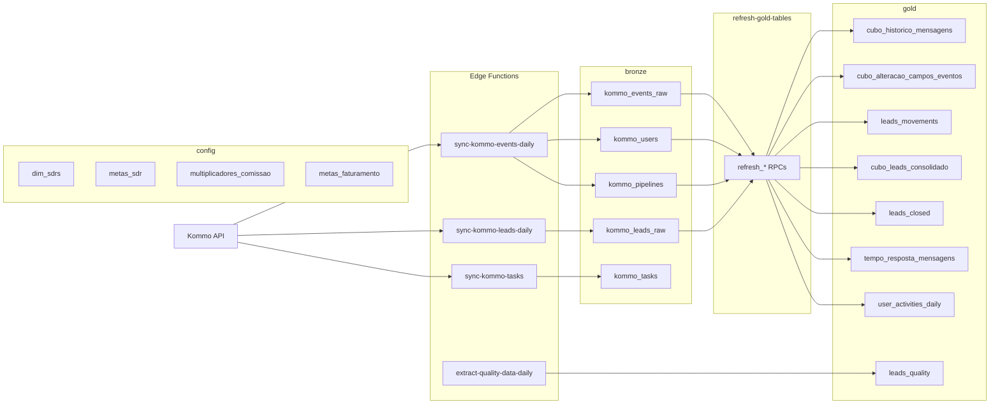

# Modelo de Dados — BI Urânia

Arquitetura medallion em Supabase (`wkunbifgxntzbufjkize`, nome interno `bi-analysis`). Três schemas aplicativos + `public` para funções utilitárias.

## Fluxo macro



## Cron jobs

Configurados via `pg_cron`, disparam edge functions por `pg_net`. Horários em UTC (Brasília = UTC-3).

| jobid | Job | Cron | UTC | BRT | O que faz |
|---|---|---|---|---|---|
| 9 | `sync-kommo-events-daily` | `15 6 * * *` | 06:15 | 03:15 | Puxa eventos novos do Kommo → `bronze.kommo_events_raw` |
| 10 | `sync-kommo-leads-daily` | `15 7 * * *` | 07:15 | 04:15 | Puxa leads atualizados → `bronze.kommo_leads_raw` |
| 11 | `sync-kommo-quality-daily` | `30 7 * * *` | 07:30 | 04:30 | Extrai campos de qualidade → `gold.leads_quality` (via `extract-quality-data-daily`) |
| 14 | `sync-kommo-tasks-daily` | `45 7 * * *` | 07:45 | 04:45 | Puxa tasks abertas do Kommo → `bronze.kommo_tasks` |
| 12 | `refresh-gold-tables-daily` | `0 8 * * *` | 08:00 | 05:00 | Roda todas as `refresh_*()` RPCs para reconstruir `gold.*` |
| 13 | `check-sync-health-daily` | `30 8 * * *` | 08:30 | 05:30 | Valida que o pipeline rodou e loga falhas |

Listagem viva:

```sql
SELECT jobid, jobname, schedule FROM cron.job ORDER BY jobid;
```

## Schema `bronze` — dados brutos do Kommo

Tabelas espelho do Kommo, atualizadas por edge functions. Chaves primárias = IDs do Kommo.

### `bronze.kommo_events_raw` (~4,6M linhas)

Todo evento do Kommo: mensagem, mudança de campo, movimentação, tarefa, responsible change, etc.

| Coluna | Tipo | Descrição |
|---|---|---|
| `id` | text PK | ID do evento no Kommo |
| `type` | text | Tipo do evento. Ex: `outgoing_chat_message`, `incoming_chat_message`, `lead_status_changed`, `entity_responsible_changed`, `custom_field_{id}_value_changed`, `task_added`, `task_completed`, `lead_added`, `outgoing_call`, `service_note_added`, `entity_direct_message`, `entity_tag_added`, etc. |
| `entity_id` | bigint | ID da entidade (lead, contato, etc.) |
| `entity_type` | text | `lead`, `contact`, `company` |
| `created_by` | bigint | FK para `kommo_users.id` |
| `created_at` | timestamptz | Momento do evento no fuso UTC |
| `value_before` | jsonb | Estado anterior (depende do tipo) |
| `value_after` | jsonb | Estado posterior |
| `account_id` | bigint | ID da conta Kommo (30633731) |
| `synced_at` | timestamptz | Quando foi sincronizado |

**Índices:** `type`, `(entity_type, entity_id)`, `created_at DESC`, `created_by`, PK `id`.

**Formatos importantes de `value_*`:**
- `lead_status_changed`: `value_after[0].lead_status.pipeline_id` e `...id`
- `entity_responsible_changed`: `value_after[0].responsible_user.id`
- `custom_field_{N}_value_changed`: `value_before[0].value`, `value_after[0].value`
- `outgoing_chat_message`/`incoming_chat_message`: `value_after[0].message.origin`, `.talk_id`

### `bronze.kommo_leads_raw` (~268k linhas)

Snapshot atual de todos os leads. Atualizado incrementalmente (leads modificados nos últimos 3 dias).

| Coluna | Tipo | Descrição |
|---|---|---|
| `id` | bigint PK | ID do lead no Kommo |
| `name` | text | Nome do lead |
| `price` | numeric | `lead.price` no Kommo |
| `responsible_user_id` | bigint | FK `kommo_users.id` — responsável atual |
| `pipeline_id`, `status_id` | bigint | Estado atual (usado em `kommo_pipelines`) |
| `status_id` IN (142, 143) | | Won / Lost do Kommo |
| `created_at`, `updated_at`, `closed_at` | timestamptz | Datas do lead |
| `closest_task_at` | timestamptz | Próxima tarefa pendente |
| `is_deleted` | bool | Marcador de deleção lógica |
| `pipeline_name`, `status_name`, `responsible_user_name` | text | Denormalizados para queries rápidas |
| `custom_fields` | jsonb | Dicionário `{"Nome do Campo": "valor"}` com todos os custom fields do lead |

**Índices:** PK `id`, `pipeline_id`, `status_id`, `responsible_user_id`, `created_at DESC`, `closed_at`, `pipeline_name WHERE NOT NULL`.

### `bronze.kommo_tasks` (~16k linhas)

Tarefas abertas (sincroniza apenas `is_completed=false`). Fonte do snapshot "tarefas em atraso" / "sem tarefa" no Monitoramento.

| Coluna | Tipo | Descrição |
|---|---|---|
| `id` | bigint PK | ID da task no Kommo |
| `text` | text | Texto livre da task |
| `task_type_id` | bigint | 1=Call, 2=Meeting, 3=Letter, demais = customizados |
| `entity_id`, `entity_type` | | Entidade (geralmente `entity_type='leads'`) |
| `responsible_user_id`, `responsible_user_name` | | Dono da task |
| `is_completed` | bool | Se completada |
| `complete_till` | timestamptz | Prazo. Se `< NOW()` e `is_completed=false` → atrasada |
| `duration` | integer | Duração estimada (segundos) |
| `created_by`, `created_at`, `updated_at` | | Metadados |
| `result`, `custom_fields` | jsonb | Payloads |

**Índices:** PK, `entity_id`, `responsible_user_id`, `complete_till`, `is_completed`.

### `bronze.kommo_custom_fields` (~281 linhas)

Catálogo de **todos os custom fields** do Kommo (leads, contacts, companies), sincronizado pela edge function `sync-kommo-custom-fields`. Usado para resolver `campo_id → campo_nome` e para montar a whitelist humana em `config.dim_campos`.

| Coluna | Tipo | Descrição |
|---|---|---|
| `id` | bigint PK | ID do custom field no Kommo |
| `name` | text | Nome visível (ex.: `'Vendedor/Consultor'`, `'Data de Fechamento'`) |
| `type` | text | `text`, `numeric`, `select`, `multiselect`, `date`, `date_time`, `checkbox`, `radiobutton`, `textarea`, `url`, `legal_entity`, etc. |
| `entity_type` | text | `leads`, `contacts`, `companies` |
| `code` | text | Código interno do Kommo (geralmente `null`) |
| `is_deletable`, `is_computed` | bool | Metadados |
| `sort`, `group_id` | | Ordem e grupo no formulário do Kommo |
| `synced_at` | timestamptz | |

**Índices:** PK, `entity_type`.

### `bronze.kommo_users` (~94 linhas)

| Coluna | Tipo | Descrição |
|---|---|---|
| `id` | bigint PK | ID Kommo do usuário |
| `name`, `email` | | Identificação |
| `role_id`, `role_name` | | Cargo/role |
| `group_id`, `group_name` | | Grupo: `'Consultores Inbound'`, `'SDR'`, etc. |
| `is_active` | bool | Se está ativo |

Consultores Inbound = vendedores. SDR = SDR. Filtros de dashboards geralmente usam `is_active=true AND group_name IN (...)`.

### `bronze.kommo_pipelines` (~221 linhas)

Catálogo de funis + estágios (composta: `pipeline_id` × `status_id`).

| Coluna | Tipo | Descrição |
|---|---|---|
| `pipeline_id` | bigint PK (parte 1) | |
| `pipeline_name` | text | Ex: `'Vendas WhatsApp'`, `'Onboarding Escolas'`, `'Recepção Leads Insta'` |
| `status_id` | bigint PK (parte 2) | |
| `status_name` | text | Ex: `'Negociação'`, `'Geladeira'`, `'Venda provável'`, `'Falar com Direção/Decisor'` |
| `sort` | int | Ordem do estágio no funil |

## Schema `gold` — tabelas consumíveis

Reconstruídas do zero por `gold.refresh_*()` todo dia às 08:00 UTC. Chaves naturais vêm de `event_id` quando aplicável.

### `gold.cubo_leads_consolidado` (~268k linhas)

Fonte primária da maioria dos dashboards. Cada linha = uma passagem de lead por um funil (deduplicado por `id_passagem = id_lead || '_' || pipeline_id || '_' || Data_de_Fechamento`).

**Colunas relevantes:**

| Coluna | Tipo | Como é calculado |
|---|---|---|
| `id_lead` | bigint | `kommo_leads_raw.id` |
| `id_passagem` | text (unique) | Concatenação identificando a passagem do lead |
| `nome_lead`, `valor_total` | | `kommo_leads_raw.name`, `.price` |
| `funil_atual`, `estagio_atual` | text | `.pipeline_name`, `.status_name` |
| `funil_lead` | text | Alias de `funil_atual` (histórico) |
| `status_lead` | text | Derivado: `'Cancelado'` se `custom_fields.'Cancelado (Onboarding)'='Sim'`; `'Venda Fechada'` se em funil de pós-venda + Data de Fechamento definida; `'Venda Perdida'` se status ILIKE `%perdida%`/`%lost%`; senão `'Em andamento'` |
| `vendedor` | text | `custom_fields.'Vendedor/Consultor'` |
| `sdr` | text | `custom_fields.'SDR'` |
| `data_criacao` | timestamptz | `kommo_leads_raw.created_at` |
| `data_de_fechamento` | date | `to_timestamp((custom_fields.'Data de Fechamento')::bigint)::date` (parsing Unix epoch) |
| `data_e_hora_do_agendamento` | timestamptz | idem para `'Data e Hora do Agendamento'` |
| `data_cancelamento` | date | idem para `'Data cancelamento'` |
| `tipo_lead`, `tipo_cliente` | text | `custom_fields.'Tipo de cliente'` |
| `cidade_estado` | text | `custom_fields.'Cidade - Estado'` |
| `produtos`, `numero_de_diarias` | text | Custom fields |
| `faixa_alunos`, `n_alunos` | text | Custom fields |
| `experiencia`, `conteudo_apresentacao`, `astronomo` | text | Custom fields |
| `canal_entrada`, `origem_oportunidade` | text | Custom fields |
| `horizonte_agendamento`, `turnos_evento`, `brinde` | text | Custom fields |
| `cancelado` | bool | `custom_fields.'Cancelado (Onboarding)'='Sim'` |
| `is_deleted` | bool | `kommo_leads_raw.is_deleted` |

**Índices:** `id_lead`, `vendedor`, `status_lead`, `funil_lead`, `data_de_fechamento DESC`, `data_e_hora_do_agendamento`, `id_passagem` unique.

**SQL da refresh** (resumo — ver `gold.refresh_leads_consolidado()` completo no final do arquivo):

```sql
INSERT INTO gold.cubo_leads_consolidado (...)
SELECT
  l.id,
  l.id || '_' || pipeline_id || '_' || 'Data de Fechamento',
  l.name, l.price,
  l.pipeline_name, l.status_name, l.pipeline_name,
  CASE
    WHEN l.custom_fields->>'Cancelado (Onboarding)' = 'Sim' THEN 'Cancelado'
    WHEN l.pipeline_name IN ('Onboarding Escolas','Onboarding SME','Financeiro','Clientes - CS','Shopping Fechados')
         AND l.custom_fields->>'Data de Fechamento' IS NOT NULL THEN 'Venda Fechada'
    WHEN l.status_name ILIKE '%perdida%' OR l.status_name ILIKE '%lost%' THEN 'Venda Perdida'
    ELSE 'Em andamento'
  END,
  l.custom_fields->>'Vendedor/Consultor',
  l.custom_fields->>'SDR',
  ...
FROM bronze.kommo_leads_raw l
WHERE l.is_deleted = FALSE OR l.is_deleted IS NULL;
```

### `gold.leads_closed` (~521 linhas)

Apenas leads que **entraram em Onboarding** (Escolas ou SME), com `Vendedor/Consultor` preenchido, com `Data de Fechamento` e `Data e Hora do Agendamento`, e onde `Data de Fechamento < Data de Agendamento`. Cobre dois casos:

1. **Entrada externa**: lead veio de outro funil (ex.: Vendas WhatsApp → Onboarding Escolas)
2. **Entrada interna**: lead nasceu no Onboarding e não saiu para Vendas/Outbound posteriormente

Detecta cancelamento quando o lead sai de Onboarding para Vendas/Recepção/Outbound após entrar.

Ver a função completa em `gold.refresh_leads_closed()` no [final do arquivo](#anexos).

### `gold.leads_movements` (~286k linhas)

Histórico de mudanças de estágio/funil. Uma linha por evento `lead_status_changed`.

| Coluna | Como é calculado |
|---|---|
| `event_id` | `kommo_events_raw.id` |
| `lead_id` | `entity_id` do evento |
| `pipeline_from_id`/`pipeline_from` | `value_before[0].lead_status.pipeline_id` + JOIN `kommo_pipelines` |
| `status_from_id`/`status_from` | `value_before[0].lead_status.id` + JOIN |
| `pipeline_to_id`/`pipeline_to` | `value_after[0].lead_status.pipeline_id` |
| `status_to_id`/`status_to` | `value_after[0].lead_status.id` |
| `moved_by_id`/`moved_by` | `created_by` + JOIN `kommo_users` |
| `moved_at` | `created_at` |

**Índices:** `lead_id`, `moved_at DESC`, `pipeline_to_id`, `event_id` unique.

### `gold.cubo_historico_mensagens` (~1,1M linhas)

Tabela base de mensagens (chat + DM), input do `gold.tempo_resposta_mensagens`.

| Coluna | Como é calculado |
|---|---|
| `tipo` | `'recebida'` se `e.type='incoming_chat_message'`, senão `'enviada'` |
| `criado_por_id`/`criado_por` | `e.created_by` + JOIN `kommo_users.name` |
| `data_criacao`, `data_criacao_brt` | `e.created_at` (UTC), idem `AT TIME ZONE 'America/Sao_Paulo'` |
| `dia_util` | `ISODOW(brt) <= 5` |
| `hora_brt` | `EXTRACT(HOUR FROM brt)::int` |
| `dentro_janela` | `dia_util AND hora_brt BETWEEN 7 AND 18` |
| `talk_id` | `value_after[0].message.talk_id` |
| `message_origin` | `value_after[0].message.origin` |

Filtro de origem: `e.type IN ('outgoing_chat_message', 'incoming_chat_message', 'entity_direct_message')`.

### `gold.tempo_resposta_mensagens` (~248k linhas)

Par (recebida, primeira resposta enviada) por `talk_id`, com tempo em minutos úteis.

```sql
-- De gold.refresh_tempo_resposta
INSERT INTO gold.tempo_resposta_mensagens (...)
SELECT
  i.event_id, i.talk_id, i.lead_id,
  i.data_criacao, o.data_criacao,
  public.business_minutes(i.data_criacao, o.data_criacao),
  o.criado_por_id, o.criado_por,
  CASE
    WHEN business_minutes(...) < 5 THEN '< 5 min'
    WHEN business_minutes(...) < 10 THEN '< 10 min'
    WHEN business_minutes(...) < 15 THEN '< 15 min'
    WHEN business_minutes(...) < 30 THEN '< 30 min'
    ELSE '> 30 min'
  END,
  i.dentro_janela
FROM gold.cubo_historico_mensagens i
CROSS JOIN LATERAL (
  SELECT data_criacao, criado_por_id, criado_por
  FROM gold.cubo_historico_mensagens
  WHERE talk_id = i.talk_id
    AND tipo = 'enviada'
    AND data_criacao > i.data_criacao
  ORDER BY data_criacao LIMIT 1
) o
WHERE i.tipo = 'recebida' AND i.talk_id IS NOT NULL;
```

| Coluna | Descrição |
|---|---|
| `msg_received_id` | `event_id` da mensagem recebida (unique) |
| `talk_id`, `lead_id` | Chaves da conversa/lead |
| `received_at`, `responded_at` | Timestamps |
| `response_minutes` | `business_minutes(received_at, responded_at)` — só conta horário comercial |
| `responder_user_id`/`responder_user_name` | Quem respondeu |
| `faixa` | Classificação em 5 buckets |
| `recebida_dentro_janela` | Se a mensagem recebida caiu em horário comercial |

### `gold.cubo_alteracao_campos_eventos` (~1,1M linhas)

Cada evento de mudança de campo custom, expandido com contexto.

| Coluna | Como é calculado |
|---|---|
| `campo_alterado` | Se `e.type = 'custom_field_N_value_changed'`, extrai `N`; senão o próprio `e.type` |
| `campo_id` | idem, mas `bigint` |
| `criado_por_id`/`criado_por` | `e.created_by` + JOIN `kommo_users.name` |
| `data_criacao`, `dia_util`, `hora_brt`, `dentro_janela` | Idem `cubo_historico_mensagens` (BRT, 7–18h, seg–sex) |
| `valor_antes`, `valor_depois` | `e.value_before->0->>'value'`, `e.value_after->0->>'value'` |

Filtro de origem: `e.type LIKE 'custom_field_%' OR e.type = 'sale_field_changed'`.

**⚠️ Filtro de ação humana**: os hooks e RPCs de SDR/Vendedor/Consistência CRM **não** consomem esta tabela diretamente. Em vez disso usam a view [`gold.alteracoes_humanas`](#goldalteracoes_humanas-view), que faz `JOIN` com `config.dim_campos` para manter apenas os campos marcados como ação humana (whitelist editável de ~62 campos hoje). Ver [`business-rules.md`](business-rules.md#whitelist-de-campos-humanos).

### `gold.alteracoes_humanas` (view)

View que filtra `gold.cubo_alteracao_campos_eventos` pela whitelist em `config.dim_campos` e traz o nome legível do campo via `bronze.kommo_custom_fields`.

```sql
CREATE OR REPLACE VIEW gold.alteracoes_humanas AS
SELECT
  c.id, c.event_id, c.lead_id, c.entity_type,
  c.campo_alterado, c.campo_id,
  kcf.name AS campo_nome,
  c.criado_por_id, c.criado_por,
  c.data_criacao, c.dia_util, c.hora_brt, c.dentro_janela,
  c.valor_antes, c.valor_depois
FROM gold.cubo_alteracao_campos_eventos c
JOIN config.dim_campos dc ON dc.campo_id = c.campo_id AND dc.incluir = true
LEFT JOIN bronze.kommo_custom_fields kcf ON kcf.id = c.campo_id;
```

**Consumida por:**
- Hook `useAlteracoesSDR` em [`desempenho-sdr/hooks/useDesempenhoSDR.ts`](../src/areas/comercial/desempenho-sdr/hooks/useDesempenhoSDR.ts)
- Hook `useAlteracoesCampos` em [`desempenho-vendedor/hooks/useDesempenhoVendedor.ts`](../src/areas/comercial/desempenho-vendedor/hooks/useDesempenhoVendedor.ts)
- RPC `gold.campos_alterados_filtrados_por_user()` (cache compatível)
- View `gold.user_activities_humanas` (deriva daqui)

**Vantagem sobre blacklist**: edições na whitelist (`config.dim_campos.incluir`) têm efeito **imediato** — não precisa refresh. Novos campos criados no Kommo aparecem em `bronze.kommo_custom_fields` após o próximo sync, mas entram em `config.dim_campos` com `incluir = false` por default (isolamento seguro).

### `gold.user_activities_daily` (~172k linhas)

Agregado diário/por hora por usuário e tipo de evento, para o Monitoramento.

```sql
-- De gold.refresh_user_activities
INSERT INTO gold.user_activities_daily (...)
SELECT
  e.created_by, u.name, u.group_name,
  DATE(e.created_at AT TIME ZONE 'America/Sao_Paulo'),
  EXTRACT(HOUR FROM brt)::int,
  e.type,
  CASE
    WHEN e.type IN ('outgoing_chat_message','entity_direct_message') THEN 'Mensagem Enviada'
    WHEN e.type LIKE 'task%' THEN 'Tarefa'
    WHEN e.type LIKE '%note%' THEN 'Nota'
    WHEN e.type IN ('lead_status_changed','entity_responsible_changed','lead_added') THEN 'Movimentacao'
    WHEN e.type LIKE 'custom_field%' OR e.type = 'sale_field_changed' THEN 'Campo alterado'
    WHEN e.type LIKE '%call%' THEN 'Ligacao'
    WHEN e.type LIKE '%mail%' THEN 'E-mail'
    ELSE 'Outros'
  END,
  e.entity_type,
  COUNT(*)
FROM bronze.kommo_events_raw e
JOIN bronze.kommo_users u ON u.id = e.created_by
WHERE u.group_name IN ('SDR', 'Consultores Inbound')
  AND u.is_active = TRUE
  AND e.type != 'incoming_chat_message'
GROUP BY e.created_by, u.name, u.group_name, DATE(brt), EXTRACT(HOUR FROM brt),
         e.type, e.entity_type;
```

⚠️ **Esta tabela ainda contém dados brutos** — todo o Monitoramento de Usuários agora lê a view filtrada [`gold.user_activities_humanas`](#goldu­ser_activities_humanas-view) que exclui campos fora da whitelist e edições de tarefa que não são criação/conclusão.

**Categorias possíveis em `category`:** Mensagem Enviada, Tarefa, Nota, Movimentacao, Campo alterado, Ligacao, E-mail, Outros. Além dessas, o frontend encontra `Tag`, `Vinculacao`, `Conversa`, `Contato/Empresa` em dados legados — não aparecem nas refreshes atuais mas estão mapeadas em `CATEGORY_COLORS` para compatibilidade.

### `gold.user_activities_humanas` (view)

View filtrada sobre `gold.user_activities_daily` aplicando as mesmas regras do Consistência CRM:

- **Campos alterados** — exclui eventos `custom_field_X_value_changed` em que `X` não está em `config.dim_campos.incluir = true`. Resultado: só conta os ~62 campos marcados como ação humana.
- **Tarefas** — exclui `task_text_changed`, `task_deadline_changed`, `task_type_changed`, `task_deleted` e `task_result_added`. Mantém apenas `task_added` (criação manual) e `task_completed` (conclusão manual).

```sql
CREATE OR REPLACE VIEW gold.user_activities_humanas AS
SELECT uad.*
FROM gold.user_activities_daily uad
WHERE NOT (
  (uad.event_type ~ '^custom_field_\d+_value_changed$'
    AND (substring(uad.event_type from 'custom_field_(\d+)_value_changed')::bigint)
      NOT IN (SELECT campo_id FROM config.dim_campos WHERE incluir = true))
  OR uad.event_type IN (
    'task_text_changed', 'task_deadline_changed', 'task_type_changed',
    'task_deleted', 'task_result_added'
  )
);
```

**Consumida por:** `useActivitiesData` em [`monitoramento/hooks/useActivitiesData.ts`](../src/areas/comercial/monitoramento/hooks/useActivitiesData.ts) — fonte única para Visão Geral, Por Categoria, Por Usuário, Consistência CRM e Ranking por Percentil.

**Impacto em abril 2026:** 194.035 → 172.212 eventos (redução de ~22k, tirando 601 eventos de campos fora da whitelist e ~21k edições de tarefa).

### `gold.leads_quality` (~164 linhas)

Gerada pela edge function `extract-quality-data-daily` (não pelo `refresh_*`). Cada lead que passou pela avaliação qualitativa vira uma linha com ~40 campos customizados:

- Metadados: `kommo_lead_id`, `lead_name`, `lead_price`, `pipeline_name`, `status_name`, `responsible_user`
- Contexto: `dia_semana_criacao`, `tipo_de_dia`, `faixa_horario_criacao`, `quem_atendeu_primeiro`
- Qualidade (critérios Sim/Parcial/Não): `qualidade_abordagem_inicial`, `personalizacao_atendimento`, `clareza_comunicacao`, `conectou_solucao_necessidade`, `explicou_beneficios`, `personalizou_argumentacao`, `proximo_passo_definido`
- Descontos: `houve_desconto`, `desconto_justificado`, `quebrou_preco_sem_necessidade`
- Retornos: `retorno_etapa_funil`, `retorno_resgate`
- Tempo: `tempo_primeira_resposta`, `dias_ate_fechar`, `ligacoes_feitas`
- Livre: `observacoes_gerais`, `ponto_critico`, `ponto_positivo`, `score_qualidade`

Score vem classificado em 4 buckets pelo avaliador: `'90–100 → Excelente'`, `'75–89 → Bom'`, `'60–74 → Regular'`, `'<60 → Crítico'`.

### `gold.tempo_resposta_mensagens` — ver acima

## Schema `config` — tabelas editáveis

### `config.dim_sdrs` (27 linhas)

Dimensão de SDRs com nível e vigência.

| Coluna | Tipo | Descrição |
|---|---|---|
| `nome` | text | Nome do SDR |
| `nivel` | text | Check constraint: `'Junior 01'`, `'Junior 02'`, `'Pleno 01'`, `'Pleno 02'` |
| `vigencia_inicio`, `vigencia_fim` | date | Para filtrar SDRs no período |
| `ativo` | bool | Default `true` |

### `config.metas_sdr` (4 linhas — uma por nível)

Metas mensais por nível, usadas no cálculo do MPA.

| Coluna | Significado |
|---|---|
| `nivel` | FK para `dim_sdrs.nivel` |
| `meta_tempo_resposta` | Alvo de nota de tempo (0-1) |
| `meta_msg_diaria` | Alvo de mensagens enviadas por dia útil |
| `meta_campos_diarios` | Alvo de alterações de campo por dia útil |
| `meta_conversao` | Alvo de % de conversão (leads qualificados / leads recebidos) |
| `comissao_variavel_base` | R$ base da comissão variável por mês |
| `vigencia_inicio`, `vigencia_fim` | Período de vigência (default: 2026-01-01) |

**Unique:** `(nivel, vigencia_inicio)`.

### `config.multiplicadores_comissao` (7 linhas)

Faixas de MPA × multiplicador aplicado à comissão base.

| Coluna | Descrição |
|---|---|
| `mpa_min`, `mpa_max` | Faixa de MPA (%) |
| `multiplicador` | Fator multiplicativo (ex.: 0.0, 0.5, 1.0, 1.5, 2.0) |

**Unique:** `(mpa_min, mpa_max)`.

Regra adicional no código: se `mpa > 100`, usa `mpa / 100` como multiplicador direto, ignorando a tabela (ver `calcMultiplicador` em `desempenho-sdr/types.ts:91-97`).

### `config.dim_campos` (~250 linhas)

Whitelist de custom fields do Kommo considerados **ação humana** para efeito de métricas. Substitui a blacklist de 6 campos-bot que existia antes.

| Coluna | Descrição |
|---|---|
| `campo_id` | PK, FK lógica para `bronze.kommo_custom_fields.id` |
| `incluir` | bool — se `true`, o campo entra em `gold.alteracoes_humanas` |
| `nota` | text livre — razão da inclusão/exclusão |
| `updated_at` | timestamptz — atualizado automaticamente via trigger |

**Preenchimento inicial:** ~250 campos sincronizados (todos com `incluir = false`), 62 marcados como `true` baseado na whitelist do time comercial (ver [business-rules.md → Whitelist](business-rules.md#whitelist-de-campos-humanos)).

**Como editar a whitelist:**
```sql
-- Marcar campos como humano
UPDATE config.dim_campos SET incluir = true, nota = 'motivo'
WHERE campo_id IN (1234, 5678);

-- Tirar da whitelist
UPDATE config.dim_campos SET incluir = false WHERE campo_id = 1234;

-- Listar os atuais
SELECT dc.campo_id, kcf.name, dc.incluir, dc.nota
FROM config.dim_campos dc
JOIN bronze.kommo_custom_fields kcf ON kcf.id = dc.campo_id
ORDER BY dc.incluir DESC, kcf.name;
```

### `config.metas_faturamento` (12 linhas por ano)

| Coluna | Descrição |
|---|---|
| `ano`, `mes` | Mês-alvo (`mes` CHECK 1-12) |
| `meta_70`, `meta_80`, `meta_90`, `meta_100` | Quatro níveis de meta em R$ |

**Unique:** `(ano, mes)`.

## RPCs (`gold.*` e `public.*`)

### `public.business_minutes(from_ts, to_ts) → integer`

Conta minutos em horário comercial (seg-sex, 7h-19h BRT) entre dois timestamps.

```sql
-- Essência do algoritmo
FOR cur_date IN [from_date..to_date]:
  IF ISODOW(cur_date) <= 5:  -- seg-sex
    day_start = cur_date + 7h
    day_end   = cur_date + 19h
    effective_start = GREATEST(day_start, brt_from)
    effective_end   = LEAST(day_end, brt_to)
    IF effective_end > effective_start:
      total += (effective_end - effective_start) in minutes
RETURN total
```

**Uso:** calcular `response_minutes` em `tempo_resposta_mensagens`. Garante que uma mensagem recebida sexta 18:50 e respondida segunda 08:00 conte só os ~70 minutos úteis que de fato se passaram, não o fim de semana.

### `gold.campos_alterados_filtrados_por_user(p_from, p_to) → TABLE(user_id, total)`

Conta alterações de campo por usuário no período, restritas à whitelist em `config.dim_campos`.

```sql
SELECT criado_por_id AS user_id, COUNT(*)::bigint AS total
FROM gold.alteracoes_humanas
WHERE data_criacao >= p_from
  AND data_criacao <= p_to
  AND criado_por_id IS NOT NULL
GROUP BY criado_por_id;
```

**Consumido por:** `useCamposAlteradosFiltered` em [src/areas/comercial/monitoramento/hooks/useConsistenciaData.ts](../src/areas/comercial/monitoramento/hooks/useConsistenciaData.ts).

### `gold.leads_atribuidos_por_user(p_from, p_to) → TABLE(user_id, leads)`

Reconstrói intervalos de responsabilidade por lead a partir de `entity_responsible_changed` e retorna, por usuário, quantos leads únicos ele foi responsável em algum momento do período — restrito a leads atualmente no pipeline `Vendas WhatsApp`.

**Dupla contagem intencional**: se um lead passou de V1 para V2 dentro do período, conta para ambos.

```sql
WITH leads_wpp AS (
  SELECT id, responsible_user_id FROM bronze.kommo_leads_raw
  WHERE pipeline_name = 'Vendas WhatsApp'
),
events_parsed AS (
  SELECT
    e.entity_id AS lead_id, e.created_at,
    (e.value_before->0->'responsible_user'->>'id')::bigint AS user_before,
    (e.value_after->0->'responsible_user'->>'id')::bigint AS user_after,
    ROW_NUMBER() OVER (PARTITION BY e.entity_id ORDER BY e.created_at) AS rn_asc
  FROM bronze.kommo_events_raw e
  JOIN leads_wpp l ON l.id = e.entity_id
  WHERE e.type = 'entity_responsible_changed' AND e.entity_type = 'lead'
),
intervals AS (
  -- Intervalo após cada evento: user_after vigora daquela data até o próximo evento
  SELECT lead_id, user_after AS user_id, created_at AS start_at,
         LEAD(created_at) OVER (PARTITION BY lead_id ORDER BY created_at) AS end_at
  FROM events_parsed
  UNION ALL
  -- Intervalo antes do primeiro evento: user_before vigorava até o primeiro evento
  SELECT lead_id, user_before, '-infinity', created_at
  FROM events_parsed WHERE rn_asc = 1
  UNION ALL
  -- Leads sem eventos: usuário atual vigorou desde sempre
  SELECT l.id, l.responsible_user_id, '-infinity', 'infinity'
  FROM leads_wpp l
  WHERE NOT EXISTS (SELECT 1 FROM events_parsed e WHERE e.lead_id = l.id)
)
SELECT i.user_id, COUNT(DISTINCT i.lead_id)::bigint AS leads
FROM intervals i
WHERE i.user_id IS NOT NULL AND i.user_id != 0
  AND i.start_at <= p_to
  AND (i.end_at IS NULL OR i.end_at >= p_from)
GROUP BY i.user_id;
```

**SECURITY DEFINER + statement_timeout=60s** — query leva ~8s e excede o timeout de 3s do role `anon`.

**Consumido por:** `useLeadsAtribuidosPeriodo` em [src/areas/comercial/monitoramento/hooks/useConsistenciaData.ts](../src/areas/comercial/monitoramento/hooks/useConsistenciaData.ts).

### `gold.mensagens_por_user_lead(p_from, p_to) → TABLE(user_id, total_msgs, leads_distintos)`

Conta, por usuário, total de mensagens enviadas e leads únicos que receberam mensagem no período. Lê de `gold.cubo_historico_mensagens` com `tipo='enviada'`.

```sql
SELECT
  criado_por_id AS user_id,
  COUNT(*)::bigint AS total_msgs,
  COUNT(DISTINCT lead_id)::bigint AS leads_distintos
FROM gold.cubo_historico_mensagens
WHERE tipo = 'enviada'
  AND criado_por_id IS NOT NULL
  AND data_criacao >= p_from
  AND data_criacao <= p_to
GROUP BY criado_por_id;
```

**Consumida por:** `useMensagensPorLead` em [`monitoramento/hooks/useConsistenciaData.ts`](../src/areas/comercial/monitoramento/hooks/useConsistenciaData.ts) — usada na sub-aba "Mensagem Enviada" do Monitoramento para KPI "Mensagens por Lead" e chart "Mensagens por Lead por Usuário".

### `gold.top_campos_alterados_periodo(p_from, p_to, p_limit=20) → TABLE(campo_nome, total)`

Top N campos mais alterados no período, restritos à whitelist (`gold.alteracoes_humanas`).

```sql
SELECT campo_nome, COUNT(*)::bigint AS total
FROM gold.alteracoes_humanas
WHERE data_criacao >= p_from
  AND data_criacao <= p_to
  AND campo_nome IS NOT NULL
GROUP BY campo_nome
ORDER BY total DESC
LIMIT p_limit;
```

**Consumida por:** `useTopCamposAlterados` em [`monitoramento/hooks/useConsistenciaData.ts`](../src/areas/comercial/monitoramento/hooks/useConsistenciaData.ts) — usada na sub-aba "Campo alterado" do Monitoramento.

### Funções `gold.refresh_*()`

Todas são `SECURITY DEFINER` com `statement_timeout` alto (300–900s). Seguem o padrão: TRUNCATE → INSERT SELECT → retorna `N rows inserted`.

Lista:
- `refresh_leads_consolidado()` — `cubo_leads_consolidado`
- `refresh_leads_closed()` — `leads_closed`
- `refresh_leads_movements()` — `leads_movements`
- `refresh_historico_mensagens()` — `cubo_historico_mensagens`
- `refresh_tempo_resposta()` — `tempo_resposta_mensagens` (depende de `cubo_historico_mensagens`)
- `refresh_alteracao_campos()` — `cubo_alteracao_campos_eventos`
- `refresh_user_activities()` — `user_activities_daily`

Disparadas pela edge function `refresh-gold-tables` (cron 08:00 UTC), provavelmente na ordem `historico_mensagens → tempo_resposta` (segunda depende da primeira).

Também expostas em `public.*` (wrappers) para serem invocáveis via PostgREST RPC.

### RPCs utilitárias `public.*`

- `handle_new_user()` — trigger que cria profile em `user_profiles` quando alguém se registra via `auth.users`
- `is_current_user_admin()` — usada em RLS policies
- `get_recent_cron_failures()` — monitoramento operacional
- `rls_auto_enable()` — event trigger que habilita RLS automaticamente em tabelas novas

## Edge Functions

Todas em `supabase/functions/*/index.ts`. Rodam Deno, autenticadas com `KOMMO_ACCESS_TOKEN` (long-lived token) em `Authorization: Bearer`.

| Nome | Trigger | O que faz |
|---|---|---|
| `sync-kommo-events-daily` | cron 06:15 UTC | GET `/api/v4/events` (filtrado por `updated_at >= 3d`) → upsert em `bronze.kommo_events_raw`. Também atualiza `kommo_users` e `kommo_pipelines` |
| `sync-kommo-leads-daily` | cron 07:15 UTC | GET `/api/v4/leads` (updated_at ≥ 3d) → upsert em `bronze.kommo_leads_raw` |
| `sync-kommo-tasks` | cron 07:45 UTC | GET `/api/v4/tasks?filter[is_completed]=0` → upsert em `bronze.kommo_tasks` (streaming upsert para não estourar o timeout de 150s). Aceita query params `onlyOpen`, `days`, `maxPages`, `startPage` |
| `sync-kommo-custom-fields` | manual (ad-hoc) | GET `/api/v4/{leads,contacts,companies}/custom_fields` → upsert em `bronze.kommo_custom_fields`. Usado para manter o catálogo de campos atualizado e resolver nomes. |
| `extract-quality-data-daily` | cron 07:30 UTC | Lê custom fields de qualidade em leads do Kommo → upsert em `gold.leads_quality` |
| `refresh-gold-tables` | cron 08:00 UTC | Invoca todas as `refresh_*()` via RPC, na ordem correta |
| `check-sync-health` | cron 08:30 UTC | Valida row counts e latências, retorna `{status:'ok'\|'fail', failures:N}` |

**Rate limit Kommo:** 7 req/segundo. Todos os syncs usam paginação de 250 itens e `await sleep(150ms)` entre páginas, com sleep extra a cada 6 páginas.

## Índices — resumo por tabela

| Tabela | Índices |
|---|---|
| `bronze.kommo_events_raw` | PK `id`, `type`, `(entity_type, entity_id)`, `created_at DESC`, `created_by` |
| `bronze.kommo_leads_raw` | PK `id`, `pipeline_id`, `status_id`, `responsible_user_id`, `created_at DESC`, `closed_at`, `pipeline_name WHERE NOT NULL` |
| `bronze.kommo_tasks` | PK `id`, `entity_id`, `responsible_user_id`, `complete_till`, `is_completed` |
| `gold.cubo_leads_consolidado` | PK, `id_passagem` unique, `id_lead`, `vendedor`, `status_lead`, `funil_lead`, `data_de_fechamento DESC`, `data_e_hora_do_agendamento` |
| `gold.leads_movements` | PK, `event_id` unique, `lead_id`, `moved_at DESC`, `pipeline_to_id` |
| `gold.cubo_historico_mensagens` | PK, `event_id` unique, `lead_id`, `criado_por_id`, `tipo`, `data_criacao DESC`, `dentro_janela`, `(talk_id, data_criacao)`, `(tipo, talk_id)` |
| `gold.cubo_alteracao_campos_eventos` | PK, `event_id` unique, `lead_id`, `criado_por_id`, `data_criacao DESC`, `dentro_janela` |
| `gold.tempo_resposta_mensagens` | PK, `msg_received_id` unique, `responder_user_id`, `received_at DESC`, `faixa` |
| `gold.user_activities_daily` | PK, unique `(user_id, activity_date, activity_hour, event_type, entity_type)`, `user_id`, `activity_date DESC`, `category` |
| `gold.leads_closed` | PK, `lead_id`, `vendedor`, `cancelado`, `entrada_onboarding_at DESC` |
| `gold.leads_quality` | PK, `kommo_lead_id` unique, `pipeline_name`, `responsible_user`, `vendedor_consultor`, `score_qualidade`, `cidade_estado` |

## RLS e permissões

Todas as tabelas têm RLS habilitado (policy de SELECT liberada para `anon, authenticated`). Escritas apenas pelo `service_role` (edge functions/crons).

O event trigger `public.rls_auto_enable()` liga RLS automaticamente em qualquer tabela nova criada.

## Anexos — SQL completo das refreshes

### `refresh_leads_consolidado()`

Ver seção `gold.cubo_leads_consolidado` acima.

### `refresh_leads_closed()`

Lógica em duas vertentes (entrada externa vs. interna) combinadas, com deduplicação por `(lead_id, Data de Fechamento)`. Ver arquivo `supabase/migrations/` ou consulte via:

```sql
SELECT pg_get_functiondef('gold.refresh_leads_closed'::regproc);
```

### `refresh_leads_movements()`, `refresh_historico_mensagens()`, `refresh_alteracao_campos()`, `refresh_tempo_resposta()`, `refresh_user_activities()`

Bodies completos armazenados no Supabase — consulte via `pg_get_functiondef('gold.refresh_*'::regproc)` em qualquer SQL editor.

Principais trechos já estão inline neste arquivo nas seções das respectivas tabelas.
